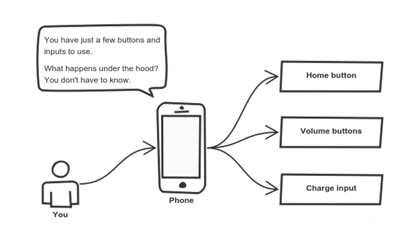
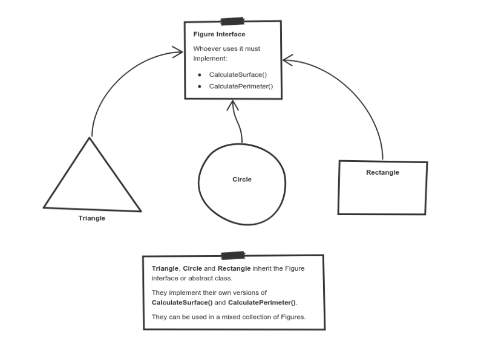

<!-- headingDivider: 2 -->

# OOP: Object Oriented Programming

## Vocabulary

* Type, Primitive, Class, Instance, Generics
* Variable, Function, Property, Method
* Inherit, Override, Implement, Abstract

## Principles

* Encapsulation
* Abstraction
* Inheritance
* Polymorphism

## Encapsulation

Hide the internal state


## Encapsulation: Example

```kotlin
class Cat {
    private var lives = 9

    public fun die() {
        if (lives > 0) lives--
        else print("Meowargh 💀")
    }
}

```

## Abstraction

Expose high level handles



## Abstraction Example

```kotlin
class CoffeeMachine {
    private var isWaterHot = false
    private fun makeEspresso() { ... }
    private fun makeLatte() { ... }
    //...

    public fun makeCoffee(coffeeType: CoffeeType) {
        when(coffeeType) {
            Espresso -> makeEspresso()
            Latte -> makeLatte()
            //...
        }
    }
}
```

## Inheritance

Extend an other Class


## Inheritance Example

```kotlin
class Animal {
    fun eat() {
        print("nom nom")
    }
}

class Cat : Animal {
    var isBored = false
    override fun eat() {
        if (isBored) {
            super.eat()
        }
    }
}
```

## Interface

```kotlin
interface FriendsDataSource {
    val url: String
    fun getFriends() : List<Friend>
}

class TwitterFriendsDataSource : FriendsDataSource {
    override val url = "https://twitter.com/friends"
    override fun getFriends() : List<Friend> {
        // request from Twitter
    }
}

class FacebookFriendsDataSource : FriendsDataSource {
    override val url = "https://facebook.com/friends"
    override fun getFriends() : List<Friend> {
        // request from Facebook
    }
}
```

## Abstract class

```kotlin
abstract class FriendsDataSource {
    val url: String
    fun getFriends() : List<Friend> {
        return emptyList()
    }
}

class TwitterFriendsDataSource : FriendsDataSource {
    override val url = "https://twitter.com/friends"
    override fun getFriends() : List<Friend> {
        // request from Twitter
    }
}

class FacebookFriendsDataSource : FriendsDataSource {
    override val url = "https://facebook.com/friends"
    override fun getFriends() : List<Friend> {
        // request from Facebook
    }
}
```

## Polymorphism

Use the same code for different types



## Polymorphism example

```kotlin
fun calculateTotalSurface(figures: List<Figure>) : Int {
    var totalSurface = 0
    figures.forEach { figure ->
        totalSurface += figure.calculateSurface()
    }
    return totalSurface
}
```

## SOLID principles

* Single-responsibility: A class should have a single responsibility
* Open–closed: open for extension, closed for modification
* Liskov substitution: No changes when replacing objects by their subtypes
* Interface segregation: Prefer several specific interfaces to a general one
* Dependency inversion: Depend upon abstractions, not concretions

## Other Principles

* DRY: Don't Repeat Yourself
* YAGNI: You Are Not Gonna Need It
* KISS: Keep it simple, stupid
* SSOT: Single source of truth

## Going Further

* Design Patterns (Singleton, Factory, ...)
* Dependency Injection
* Is Inheritance bad ?
* Often prefer composition: "has-a" VS "is-a"
* Entity Component System
* OOP is not a silver bullet

## Other Paradigms

* Procedural Programming
* Functional Programming
* Data Oriented Design
* Reactive Programming

## Links

* [How to explain object-oriented programming concepts to a 6-year-old](https://medium.freecodecamp.org/object-oriented-programming-concepts-21bb035f7260)
* [OOP](https://en.wikipedia.org/wiki/Object-oriented_programming)
* [SOLID](https://en.wikipedia.org/wiki/SOLID)
* [Uncle Bob's blog](https://blog.cleancoder.com/)
* [Brian Will's site (OOP critics, Game Development, Programming lessons)](https://brianwill.github.io/)
