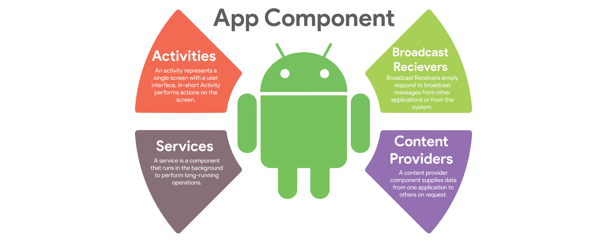

<!-- headingDivider: 2 -->

# Introduction au Dévelopment Mobile

## Kotlin


* Moderne
* Concis
* Java Interop
* Développé par JetBrains
* Kotlin everywhere: JVM, Backend, JS, KTS, iOS...

## Typage statique inféré

```kotlin
val myInt: Int = 1
val myInt = 1

val myString: String = "coucou"
val myInt = "coucou"
```

## Mutabilité

```kotlin
// valeur donnée à la compilation qui ne peut pas changer:
const val MY_CONSTANT = 0 

// valeur est donnée à l'execution qui ne peut pas changer:
val myImmutableVariable = 0 

// valeur qui peut changer:
var myMutableVariable = 0 
```

## Nullabilité

```kotlin
val nullable: MyClass? = null

// Éxécute une méthode SI l'instance est non nulle (retourne null sinon)
nullable?.toString() // soft unwrap
    
// Éxécute une méthode OU crash si l'instance est nulle
nullable!!.toString() // force unwrap

// 
nullable ?: "default" // coalesce operator
```

⚠️ Pour l'interopérabilité avec Java il faut une annotation `@Nullable`

## Smart casts

```kotlin
var nullable: MyClass?

nullable?.myMethod()

if (nullable != null) { nullable.myMethod() }
```

## When statements

Un `switch-case` sous stéroïdes

```kotlin
val primeNumbers = listOf(1, 3, 5, 7, 11, 13, 17)

val x: Any? = 13

val result = when (x) {
    null -> "x is null" // ❌ -> smart casté comme Any
    !is Int -> "x is not an int" // ❌ -> smart casté comme Int
    in 1..10 -> "x is between 1 and 10" // ❌
    !in 10..20 -> "x is not between 10 and 20" // ❌
    in primeNumbers -> "x is a prime" // ✅
    else -> "none of the above" // ignoré
}

print(result)
```

## Functions

```kotlin
fun functionName(firstArgumentName: FirstArgumentType, secondArgumentName: SecondArgumentType) : ReturnType {
  val result: ReturnType
  // ...
  return result
}

// short syntax:
fun add(first: Int, second: Int) = first + second
```

## Final class

```kotlin
class MyFinalClass {...} // classes are final by default

open class MyHeritableClass {...} // open makes them non-final
```

## Object

Permet de créer facilement un Singleton

``` kotlin
object MySingleton { 
  
  val myUtilFunction() { ... }
}

// à utiliser comme une classe `static` Java:
MySingleton.myUtilFunction() 
```

## Companion object

Permet d'avoir l'équivalent des membres `static` en Java:

``` kotlin
class MyClass {
  
  companion object {
    
    const val MY_CONSTANT = 1
  }
}

MyClass.MY_CONSTANT // interop java: MyClass.Companion.MY_CONSTANT
```

## Data class

`equals(), toString(), hashCode(), copy()` et destructuration sans rien coder !

``` kotlin
data class Point(val x: Float, val y: Float)

val pointA = Point(1.0f, 2.0f)

val (x, y) = point

val pointB = pointA.copy(y = 1.0f)

pointB.toString() // Point(x=1.0f, y=1.0f)

val pointC = Point(1.0f, 2.0f)
pointA == pointC // ➡️ true
```

## Sealed class

Classes ayant un nombre de sous classes défini et limité

``` kotlin
sealed class Result {
  
  class Success(val value: Any) : Result()
  
  class Failure(val error: Error) : Result()
}
```

➡️ Permet d'être smart-casté

## Extension functions

``` kotlin
fun String.capitalize(): String { 
  this.chars().mapIndexed { char, index -> 
    if (index == 1) char.toUpperCase() else char 
  } 
}

"blabla".reverse() // ➡️ "albalb"
```

## Delegates

``` kotlin
class DraggableButton(
  clickListener: ClickListener, 
  dragListener: DragListener
) : ClickListener by clickListener, DragListener by dragListener

val lazyString: String by lazy { "my lazy string" }
```

## Lambdas

Blocs d'éxecution qui se manipulent en tant que variables:

```kotlin
val add: (Int, Int) -> Int = { a, b -> a + b }

val result = add(1, 2) // result == 3

fun listOperation(number: Int, list: List<Int>, operation: (Int, Int) -> Int): List<Int> {
    list.forEach { element -> operation(number, element) }
}

listOperation(1, listOf(2, 4, 6, 8), add) // 3, 5, 7, 9
listOperation(1, listOf(2, 4, 6, 8)) { a, b -> a - b } // 1, 3, 5, 7

// Lambda for SAM
button.setOnClickListener { view -> ... }
```

## Kotlin Koans

Petits exercices pour prendre en main le langage:

* Soit en ligne: [try.kotl.in/koans](http://try.kotl.in/koans)

* Soit dans l'IDE (pour avoir l'autocompletion), :
  * installer le plugin Edutools: `Plugins > Marketplace > Edutools > Install`
  * accepter de redémarrer
  * Démarrer le cours: `My Courses > Start New Course > Marketplace > Kotlin Koans > Start`

# Android


## Intro


* Nombreux utilisateurs
* Devices très variables
* Versions d’OS anciennes
* Puissance limitée
* Phone, Tablet, TV, Watch, Auto, Chrome OS, Fuschia OS
* Language : Kotlin et Java
* IDE : Android Studio

## Éléments d'une app Android


* Scripts Gradle
* AndroidManifest.xml
* App
* Activity
* Fragment
* Layouts XML

## App Components



* Activity / Fragments ➡ Screen Controller
* Service ➡ Headless Controller
* Broadcast Receiver ➡ Event Listener
* ContentProvider ➡ Shared Data API

## Kotlin sur Android


* Conversion depuis Java avec Android Studio
* Android KTX
* Coroutines, Flow, ...
* Jetpack Compose
* Pas vraiment de désavantages car équivalent à Java et interop facile
* ⚠️ On peut être dépassé par les différentes possibilités offertes par Kotlin: rester simple et lisible

# iOS


* Moins de devices différents
* OS mis à jour plus rapidement
* Plus de 💰 dépensés
* Swift (interop Objective-C)
* XCode 💩

# Cross-Platform et Composants


* Permet de coder une seule fois
* On perd souvent les possibilités spécifiques ou récentes des OS (effet "PPCD")
* On perd parfois aussi en performances ou en UX
* Programmation à base "Components" à la React
* Xamarin, ReactNative, NativeScript, Ionic
* Google et Apple s’en inspirent et poussent maintenant beaucoup à utiliser:
  * Dart: Flutter (iOS, Android, Desktop, Web)
  * Swift: SwiftUI (iOS only)
  * Kotlin: Jetpack Compose (Android, Desktop, Web, iOS?)
