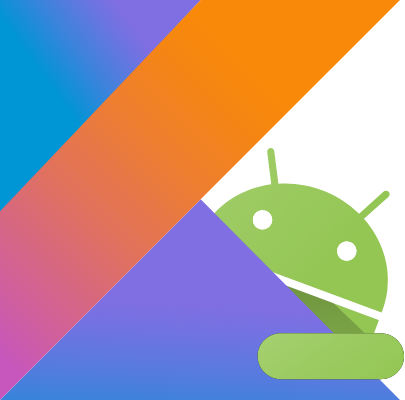

<!-- headingDivider: 2 -->
<!-- class: invert -->

# Introduction au Dévelopment Mobile

## Kotlin


* Peu verbeux
* Moderne
* Java Interop
* Développé par JetBrains
* Kotlin everywhere: JVM, Backend, JS, KTS, iOS...

## Variables

```kotlin
// Typage statique inféré
val myInt: Int = 1
val myInt = 1
val myString: String = "coucou"
val myInt = "coucou"

// Mutabilité
val myImmutableVariable = 0
var myMutableVariable = 0

// Nullabilité (Interop:  @Nullable)
val variable: SomeClass? = null
variable?.myMethod() ?: doSomethingElse()
variable!!.myMethod()

// Smart casts
var nullable: MyClass?
if (nullable != null) { nullable.myMethod() }


// When statements: super-powered switch-case statements
val primeNumbers = listOf(1, 3, 5, 7, 11, 13, 17)
val x = 13
when (x) {
    null -> print("x is null")
    !is Int -> print("x is not an int")
    in 1..10 -> print("x is between 1 and 10")
    !in 10..20 -> print("x is not between 10 and 20")
    in primeNumbers -> print("x is a prime") // ⬅️
    else -> print("none of the above")
}
```

## Classes

```kotlin
class MyFinalClass {...} // classes are final by default
open class MyHeritableClass {...} // open makes them non-final

object MySingleton { 
  val myUtilFunction() { ... }
}
MySingleton.myUtilFunction() // used like "static" methods in Java

class MyClass {
  companion object { // static fields
    const val MY_CONSTANT = 1
  }
}
MyClass.MY_CONSTANT // in java: MyClass.Companion.MY_CONSTANT

// equals(), toString(), hashCode(), copy(), destructuring for free
data class MyPojo(val someProperty: SomeType, ...)

sealed class Result { // sort of "enum classes"
  object Success : Result
  class Failure(error: Error) : Result()
}

// Extension functions
fun String.reverse(): String {...}
"blabla".reverse()

// Delegates
class Survey(firstItem: Question, vararg items: Question) : List<Question> by listOf(firstItem, *items)
```

## Lambdas

```kotlin
// Lambdas: function blocks handled as variables
val add: (Int, Int) -> Int = { a, b -> a + b }
val result = add(1, 2)

fun listOperation(number: Int, list: List<Int?>, operation: (Int, Int) -> Int): List<Int>? {
    list.forEach { element -> 
        if (element == null) return@applyOperation null // Specified return
        operation(number, element)
    }
}

listOperation(1, listOf(2, 4, 6, 8), add)
listOperation(1, listOf(2, 4, 6, 8)) { a, b -> a - b }

// Lambda for SAM
button.setOnClickListener { view -> ... }
```

## Kotlin Koans

En ligne: [try.kotl.in](try.kotl.in)

Dans l'IDE: ajouter plugin Edutools, redémarrer
puis `Start New Course > Community Courses`


# Android


## Intro


* Nombreux utilisateurs
* Devices très variables
* Versions d’OS anciennes
* Puissance limitée
* Phone, Tablet, TV, Watch, Auto, Things, Chrome OS
* Language : Java et Kotlin
* IDE : Android Studio

## Éléments d'une app Android


* Scripts Gradle
* AndroidManifest.xml
* App
* Activity
* Fragment
* Layouts XML

## App Components


* Activity / Fragments ➡ Screen Controller
* Service ➡ Headless Controller
* Broadcast Receiver ➡ Event Listener
* ContentProvider ➡ Shared Data API

## Kotlin sur Android



* Conversion depuis Java avec Android Studio
* Android KTX
* Coroutines, Flow, ...
* Jetpack Compose
* Pas vraiment de désavantages car équivalent à Java et interop facile
* ⚠️ On peut être dépassés par les features de Kotlin: rester simple et lisible

# iOS


* Moins de devices différents
* OS mis à jour plus rapidement
* Plus de 💰 dépensés
* Swift (interop Objective-C)
* XCode 💩

# Cross-Platform et Composants


* Permet de coder une seule fois
* On perd souvent les possibilités spécifiques ou récentes des OS (effet "PPCD")
* On perd parfois aussi en performances ou en UX
* Programmation à base "Components" à la React
* Xamarin, React, NativeScript, Ionic
* Google et Apple s’en inspirent et poussent maintenant beaucoup à utiliser:
  * Dart: Flutter
  * Kotlin: Jetpack Compose (desktop, web, iOS ?)
  * Swift: SwiftUI (pas cross-platform)
