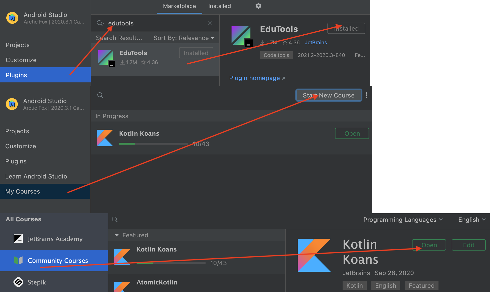
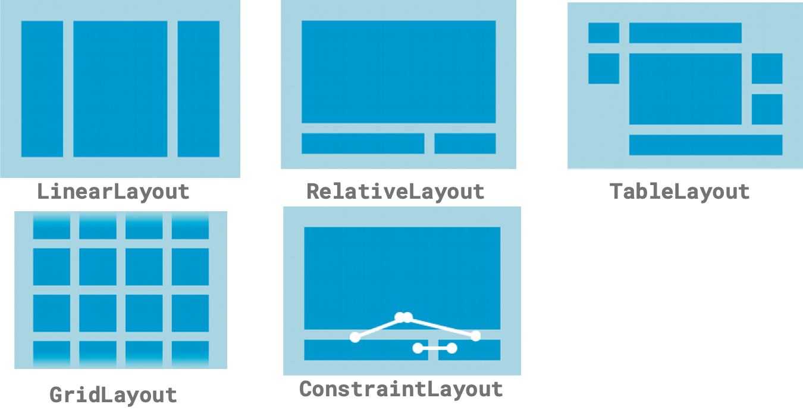

<!-- headingDivider: 2 -->
<!-- class: invert -->

# Introduction au Dévelopment Mobile

## Kotlin


* Peu verbeux
* Moderne
* Java Interop
* Développé par JetBrains
* Kotlin everywhere: JVM, Backend, JS, KTS, iOS...

## Kotlin: Bases

```kotlin
// Mutabilité
val myImmutableVariable = 0
var myMutableVariable = 0

// Nullabilité (Interop:  @Nullable)
val variable: SomeClass? = null
variable?.myMethod() ?: doSomethingElse()
variable!!.myMethod()

// Typage statique inféré
val myInt: Int = 1
val myInt = 1
```

## Kotlin: classes

```kotlin
class MyFinalClass {...} // classes are final by default
open class MyHeritableClass {...} // open makes them non-final
// equals(), toString(), hashCode(), copy(), destructuring for free
data class MyPojo(val someProperty: SomeType, ...)
class MyClass {
  companion object { // static fields
    const val MY_CONSTANT = 1
  }
}
sealed class Result { // sort of "enum classes"
  object Success : Result
  class Failure(error: Error) : Result()
}
```

## Kotlin: autres particularités

```kotlin
// Lambdas: function blocks handled as variables
val add: (Int, Int) -> Int = { a, b -> a + b }
val result = add(1, 2)

// When statements: super-powered switch-case statements
when (x) {
    !is Int -> print("x is not an int")
    in 1..10 -> print("x is in the range")
    in validNumbers -> print("x is valid")
    !in 10..20 -> print("x is outside the range")
    else -> print("none of the above")
}
```

## Kotlin Koans

En ligne: [try.kotl.in](try.kotl.in)

Dans l'IDE: plugin Edutools



## Kotlin: fonctionnalités plus avancées

```kotlin
// Extension functions
fun String.reverse(): String {...}
"blabla".reverse()

// Smart casts
var nullable: MyClass?
if (nullable != null) { nullable.myMethod() }

// Delegates
class SomeClass : SomeInterface by SomeImplementation {...}

// Lambda for SAM
button.setOnClickListener {...}

// Specified returns
fun method() {
  // ...
  for(i in 1..10) {
    // ...
    return@method
  }
}
```

# Android


## Intro


* Nombreux utilisateurs
* Devices très variables
* Versions d’OS anciennes
* Puissance limitée
* Phone, Tablet, TV, Watch, Auto, Things, Chrome OS
* Language : Java et Kotlin
* IDE : Android Studio

## Éléments d'une app Android


* Scripts Gradle
* AndroidManifest.xml
* App
* Activity
* Fragment
* Layouts XML

## App Components


* Activity / Fragments ➡ Screen Controller
* Service ➡ Headless Controller
* Broadcast Receiver ➡ Event Listener
* ContentProvider ➡ Shared Data API

## Activity / Fragment


* Component le plus important.
* Rôle: Fait le lien entre le Layout et la logique de l’app
* Attention: Éviter la tendance à mettre toute l’app dans l'Activity
* Fragment ≈ SubActivity

## Layouts

```xml
<?xml version="1.0" encoding="utf-8"?>
<androidx.cardview.widget.CardView xmlns:android="http://schemas.android.com/apk/res/android"
    xmlns:app="http://schemas.android.com/apk/res-auto"
    ...

    <androidx.constraintlayout.widget.ConstraintLayout
        ... >

        <ImageView ... />
    </androidx.constraintlayout.widget.ConstraintLayout>
</androidx.cardview.widget.CardView>
```

* Fichier XML décrivant un écran (ou une partie)
* ViewGroup: View contenant d’autres Views, avec diverses règles d’affichage: LinearLayout, RelativeLayout, ConstraintLayout, Stack, ...
* View: Élément graphique de l’interface: Text, Image, Button

## ViewGroups



## Views

```xml
<TextView
  android:id="@+id/textView_login" // reference to the view
  android:layout_width="match_parent" // use all available width in parent
  android:layout_height="wrap_content" // use only needed height
/>

<Button
  android:id="@+id/button_login"
  android:layout_width="0dp" // match width to constraints
  android:layout_height="200dp" // specify explicit height
  app:layout_constraintEnd_toEndOf="@id/textView_login" // constraint start
  app:layout_constraintStart_toStartOf="parent" // contraint end
  android:visibility="invisible" // visible, invisible or gone
/>
```

## References to views


```kotlin
// traditional
val loginTextView = findViewById<TextView>(R.id.textView_login)

// ButterKnife
@BindView(R.id.textView_login) val loginTextView: TextView

// synthetics
import kotlinx.android.synthetic.main.fragment_login.*
textView_login // directly available

// viewbinding / databinding
binding.textViewLogin
```

## Kotlin sur Android


* Tous les avantages de Kotlin
* Conversion depuis Java avec Android Studio
* Android KTX
* Synthetics
* Lambdas: setOnClickListener
* Coroutines, Flow, ...
* Compose
* Pas vraiment de désavantages car équivalent à Java et interop
* ⚠️ On peut être dépassés par les features de Kotlin: rester simple et lisible

# iOS


* Moins de devices différents
* OS mis à jour plus rapidement
* Plus de 💰 dépensés
* Swift (interop Objective-C)
* XCode 💩
* UIViewController (Équivalent de Activity)
* Storyboards (Layout XML manipulé visuellement)
* Xibs (Vue XML)

```swift
class LoginViewController: UIViewController {
    @IBOutlet weak var label: UILabel!
    @IBAction func setDefaultLabelText(_ sender: UIButton) {
        let defaultText = "Default Text"
        label.text = defaultText
    }
}
```

# Cross-Platform et Composants


* Permet de coder une seule fois
* On perd souvent les possibilités spécifiques ou récentes des OS (effet "PPCD")
* On perd parfois aussi en performances ou en UX
* Programmation à base "Components" à la React
* Xamarin, React, NativeScript, Ionic
* Google et Apple s’en inspirent et poussent maintenant beaucoup à utiliser:
  * Dart: Flutter
  * Kotlin: Jetpack Compose (desktop, web, iOS ?)
  * Swift: SwiftUI (pas cross-platform)
