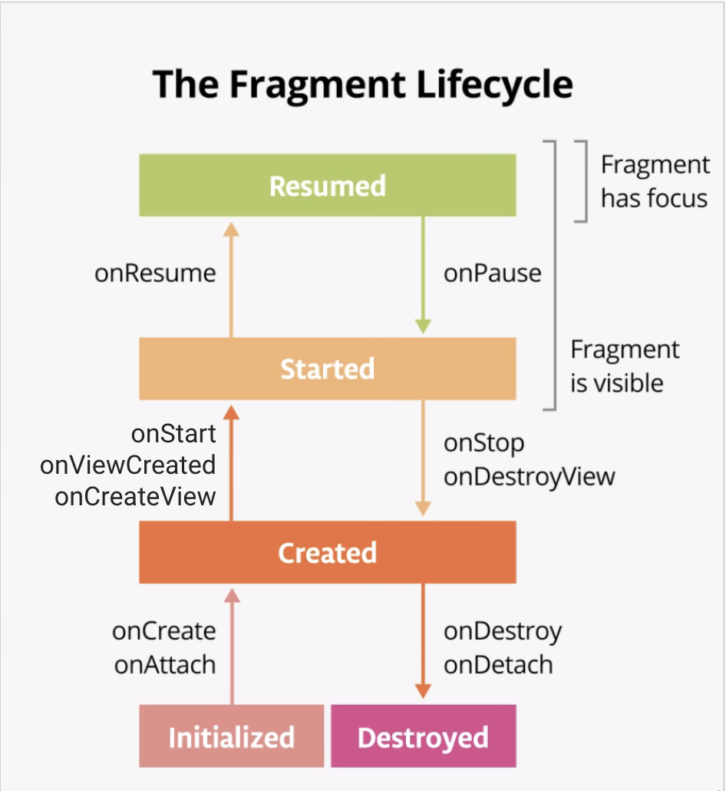

<!-- headingDivider: 2 -->
<!-- class: invert -->

# Activities, Fragments, Lifecycle

## Context

Objet très présent sur Android:

- Fourni par le système
- Interface aux infos globales sur l'environnement de l'application
- Accède aux resources et aux classes spécifiques à l'application
- Permet de lancer des `Activity`
- Diffuse et reçoit des `Intents`

## Activity


- Hérite de `Context`
- Permet d'afficher les données dans le layout
- Contrôle l’interaction entre le layout et l’utilisateur
- Représente une "page" qui  prends généralement tout l’écran
- Peut démarrer d’autres Activity dans la même app ou d’autres
- Obéit à un "Lifecycle"
- Les Activity peuvent être hiérarchisée dans le manifest (pour la navigation)
- Peut contenir des `Fragments` (sorte de "SubActivity")
- ⚠️ Éviter la tendance à mettre trop de logique dans l'Activity

## Layouts

```xml
<?xml version="1.0" encoding="utf-8"?>
<androidx.cardview.widget.CardView xmlns:android="http://schemas.android.com/apk/res/android"
    xmlns:app="http://schemas.android.com/apk/res-auto"
    ...

    <androidx.constraintlayout.widget.ConstraintLayout
        ... >

        <ImageView ... />
    </androidx.constraintlayout.widget.ConstraintLayout>
</androidx.cardview.widget.CardView>
```

- Fichier XML décrivant un écran (ou une partie)
- ViewGroup: View contenant d’autres Views, avec diverses règles d’affichage: LinearLayout, RelativeLayout, ConstraintLayout, Stack, ...
- View: Élément graphique de l’interface: Text, Image, Button

## ViewGroups


## Views

```xml
<TextView
  android:id="@+id/textView_login" // reference to the view
  android:layout_width="match_parent" // use all available width in parent
  android:layout_height="wrap_content" // use only needed height
/>

<Button
  android:id="@+id/button_login"
  android:layout_width="0dp" // match width to constraints
  android:layout_height="200dp" // specify explicit height
  app:layout_constraintEnd_toEndOf="@id/textView_login" // constraint start
  app:layout_constraintStart_toStartOf="parent" // contraint end
  android:visibility="invisible" // visible, invisible or gone
/>
```

## Inflating Layout in Activity

```kotlin
class MainActivity : AppCompatActivity() {
   override fun onCreate(savedInstanceState: Bundle?) {
       super.onCreate(savedInstanceState)
       setContentView(R.layout.activity_main) // inflate
//    access resources^ ^layouts   ^layout file name
}

class MainFragment : Fragment() {
  override fun onCreateView(...): View {
    return inflater.inflate(R.layout.fragment_main, container, false)
  }
}

```

## References to views


```kotlin
// traditional
val loginTextView = findViewById<TextView>(R.id.textView_login)

// ButterKnife
@BindView(R.id.textView_login) val loginTextView: TextView

// viewbinding / databinding
binding.textViewLogin
```

## ViewBinding

Ajouter:

```gradle
android {
    buildFeatures {
        viewBinding true
    }
}
```

Activity:

```kotlin
private lateinit var binding: ResultProfileBinding

override fun onCreate(...) {
    super.onCreate(...)
    binding = ResultProfileBinding.inflate(layoutInflater)
    setContentView(binding.root)
    binding.myButton.setOnCLickListener { ... }
}
```

Fragments: [Documentation](https://developer.android.com/topic/libraries/view-binding#fragments)

## Declare main activity in manifest

```xml
// MainActivity needs to include intent-filter to start from launcher
<activity
      android:name=".MainActivity"
      android:label="@string/app_name"
      android:theme="@style/AppTheme.NoActionBar">
  <intent-filter>
      <action android:name="android.intent.action.MAIN"/>
      <category android:name="android.intent.category.LAUNCHER"/>
  </intent-filter>
</activity>
```

# Lifecycle Components

## Activity lifecycle


## Fragment lifecycle



## Configuration Changes


- Rotation
- Changement de langage
- Mode multi-fenêtre

Android garde seulement :

- L’intent éventuellement utilisé
- L’état des vues ayant un ID (ex: RecyclerView scroll position)

## InstanceState

```kotlin
override fun onSaveInstanceState(outState: Bundle) {
   super.onSaveInstanceState(outState)
   outState.putString("key", count_text_view.text.toString())
}


override fun onCreate(savedInstanceState: Bundle?) {
   super.onCreate(savedInstanceState)
   setContentView(R.layout.activity_main)
   savedInstanceState?.getString("key").let { count ->
       count_text_view.setText(count)
   }
}
```

- Préserve les données de l’Activity
- Configuré manuellement
- Perdu si on quitte l’Activity
- Plus persistent: DB, Web, SharedPreference, DataStore

# iOS


- UIViewController (Équivalent de Activity)
- Storyboards (Layout XML manipulé visuellement)
- Xibs (Vue XML)

```swift
class LoginViewController: UIViewController {
    @IBOutlet weak var label: UILabel!
    @IBAction func setDefaultLabelText(_ sender: UIButton) {
        let defaultText = "Default Text"
        label.text = defaultText
    }
}
```

## UIViewController


- Layout:
  - StoryBoard
  - Nib (`init(nibName:bundle:)`)
  - `loadView`, `viewDidLoad`, ...
- rotation: `viewWillTransition`
- state restauration:  `restorationIdentifiers` on VC and Views
