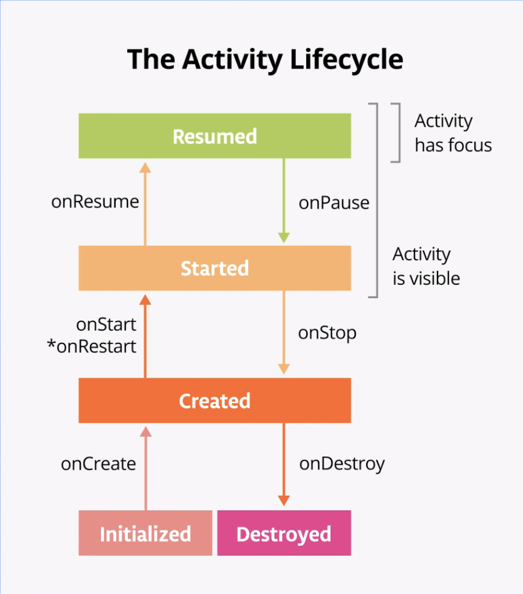

<!-- headingDivider: 2 -->
<!-- class: invert -->

# Lifecycle

## Context

Objet très présent sur Android:

- Fourni par le système
- Interface aux infos globales sur l'environnement de l'application
- Accède aux resources et aux classes spécifiques à l'application
- Permet de lancer des `Activity`
- Diffuse et reçoit des `Intents`

## Activity


- Hérite de `Context`
- Une Activity "inflate" un layout XML dans `onCreate`
- Permet d'afficher les données dans le layout
- Contrôle l’interaction entre le layout et l’utilisateur
- Représente une "page" qui  prends généralement tout l’écran
- Peut démarrer d’autres Activity dans la même app ou d’autres
- Obéit à un "Lifecycle"
- Les Activity peuvent être hiérarchisée dans le manifest (pour la navigation)
- Peut contenir des `Fragments`

## Inflating Layout in Activity

```kotlin
class MainActivity : AppCompatActivity() {
   override fun onCreate(savedInstanceState: Bundle?) {
       super.onCreate(savedInstanceState)
       setContentView(R.layout.activity_main) // inflate
//    access resources^ ^layouts   ^layout file name
}

class MainFragment : Fragment() {
  override fin onCreateView(...) {
    return inflater.inflate(R.layout.fragment_main, container, false)
  }
}

```

## Declare main activity in manifest

```xml
// MainActivity needs to include intent-filter to start from launcher
<activity
      android:name=".MainActivity"
      android:label="@string/app_name"
      android:theme="@style/AppTheme.NoActionBar">
  <intent-filter>
      <action android:name="android.intent.action.MAIN"/>
      <category android:name="android.intent.category.LAUNCHER"/>
  </intent-filter>
</activity>
```

# Lifecycle Components

## Activity lifecycle



## Fragment lifecycle


## Configuration Changes


- Rotation
- Changement de langage
- Mode multi-fenêtre

Android garde seulement :

- L’intent éventuellement utilisé
- L’état des vues ayant un ID (ex: RecyclerView scroll position)

## InstanceState

```kotlin
override fun onSaveInstanceState(outState: Bundle) {
   super.onSaveInstanceState(outState)
   outState.putString("key", count_text_view.text.toString())
}


override fun onCreate(savedInstanceState: Bundle?) {
   super.onCreate(savedInstanceState)
   setContentView(R.layout.activity_main)
   savedInstanceState?.getString("key").let { count ->
       count_text_view.setText(count)
   }
}
```

- Préserve les données de l’Activity
- Configuré manuellement
- Perdu si on quitte l’Activity
- Plus persistent: DB, Web, SharedPreference, DataStore

# iOS

## UIViewController


- Layout:
  - StoryBoard
  - Nib (`init(nibName:bundle:)`)
  - `loadView`, `viewDidLoad`, ...
- rotation: `viewWillTransition`
- state restauration:  `restorationIdentifiers` on VC and Views
