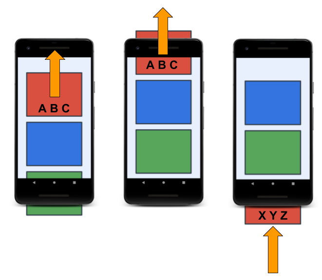

<!-- headingDivider: 2 -->
<!-- class: invert -->

# RecyclerView

## Fonctionnement



Conteneur scrollable pour afficher une grande quantité de donnée de façon efficace:

- crée un nombre limité de Views
- les réutilise en remplaçant les données et les listeners (re-bind) sans les recréer
- Met à jour les données rapidement

## List layout

```xml
<android.support.v7.widget.RecyclerView
   android:id="@+id/recyclerview"
   android:layout_width="match_parent"
   android:layout_height="match_parent"
   app:layoutManager="android.support.v7.widget.LinearLayoutManager" />
```

## Item layout

```xml
<LinearLayout
   android:layout_width="match_parent"
   android:layout_height="match_parent">
   <TextView
       android:id="@+id/word"
       android:layout_width="wrap_content"
       android:layout_height="wrap_content" />
</LinearLayout>
```

## Adapter

```kotlin
class WordListAdapter(val wordList: Word) : RecyclerView.Adapter<WordListAdapter.WordViewHolder>() {
   override fun getItemCount(): Int {
      // return the number of elements in the list
   }

   override fun onCreateViewHolder(parent: ViewGroup, viewType: Int): WordViewHolder {
      // inflate a view to create a ViewHolder instance
   }

   override fun onBindViewHolder(holder: WordViewHolder, position: Int) {
      // bind() the list element at the current position to the holder
   }

   inner class WordViewHolder(itemView: View) : RecyclerView.ViewHolder(itemView) {
    fun bind(word: Word) {
      // Fill a cell with data
    }
   }
}

// at fragment or activity creation:
val wordList = listOf("word#1", "word #2")
recyclerView.adapter = WordListAdapter(wordList)
recyclerView.layoutManager = LinearLayoutManager(context)
```

## ListAdapter

```kotlin

object WordsDiffCallback : DiffUtil.ItemCallback<ChannelUiModel>() {
   override fun areItemsTheSame(oldItem: ChannelUiModel, newItem: ChannelUiModel) =
      // are they the same "entity" ? (usually same id)
   override fun areContentsTheSame(oldItem: ChannelUiModel, newItem: ChannelUiModel) =
      // do they have the same data ? (content)
}

class WordListAdapter : ListAdapter<,Word, WordListAdapter.WordViewHolder>(WordsDiffCallback) {
   // same thing without getItemCount()
}

// at fragment or activity creation:
val myAdapter = WordListAdapter()
recyclerView.adapter = myAdapter
myAdapter.submitList(listOf("word#1", "word #2"))
```
