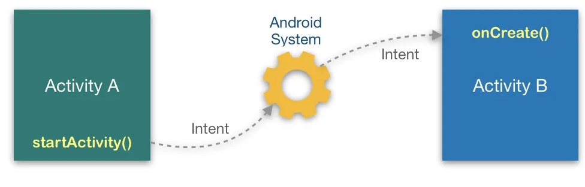
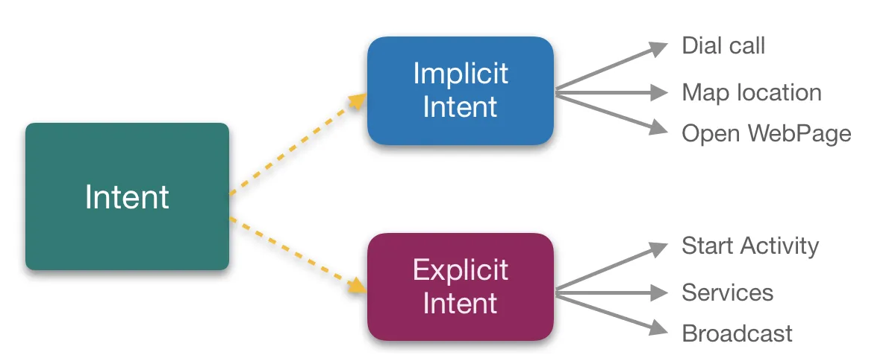
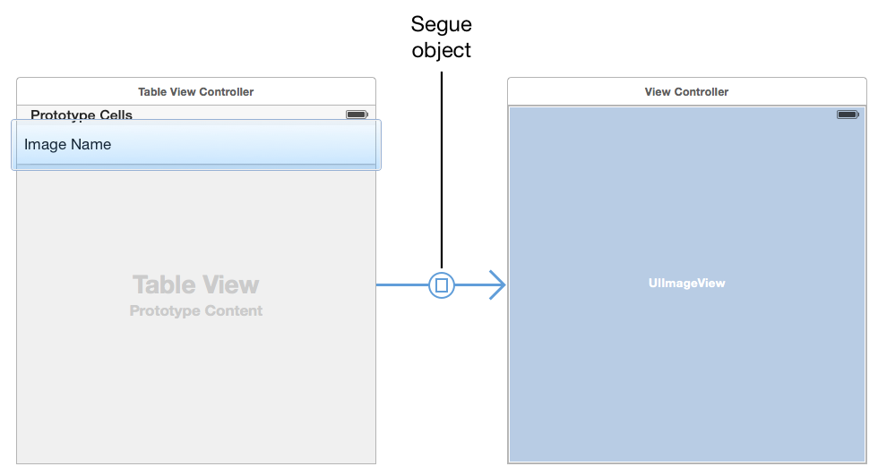
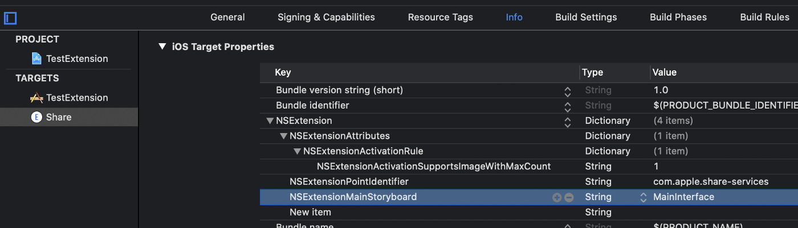

<!-- headingDivider: 2 -->
<!-- class: invert -->

# Intents

## Définition



Un objet contenant les infos nécessaires à démarrer une `Activity` (en général) ➡️ Conceptuellement proche d'un lien HTML

Sert aussi (plus rarement) à démarrer un `Service` ou à envoyer un `Broadcast`

Un intent peut être "lancé" par une application ou par le système

## Explicit / Implicit



```kotlin
val explicitIntent = Intent(this, MyActivity::class.java)

// implicit intents:
val callButtonIntent = Intent(Intent.ACTION_CALL_BUTTON)
val urlIntent = Intent(Intent.ACTION_VIEW, Uri.parse("http://www.google.com"))
val phoneIntent = Intent(Intent.ACTION_DIAL, Uri.parse("tel:8005551234"))

// use:
startActivity(intent)

// To use later (ex: in Notifications)
val pendingIntent = PendingIntent.getActivity(this, 1, intent,FLAG_UPDATE_CURRENT) // Parcelable
pendingIntent.send()
```

## Send

```kotlin
// Preparing data in sending Activity:
val intent = Intent(this, SecondActivity::class.java)

intent.data = Uri.parse("http://www.google.com") // Web URL
intent.data = Uri.fromFile(File("/file_path/file.jpg")) // File URI
intent.putExtra("level", 406) // Int extra
val array = arrayOf("Rice", "Beans", "Fruit")
intent.putExtra("food", array) // Array extra

val bundle = Bundle() // Use bundle to prepare a lot of data
bundle.putFloat("percent", 58f) // Float data
intent.putExtras(bundle) // Put whole bundle

val UNIQUE_KEY = packageName + ".extra.MESSAGE"
intent.putExtra(UNIQUE_KEY, "Hello Activity!")

startActivity(intent)

// Getting data in receiving activity:

val uri = intent.data
val level = intent.getIntExtra("level", 0)
val food = intent.getStringArrayExtra("food")

val bundle = intent.extras
val percent = bundle.getFloat("percent")
```

## Intent Filters

```xml
<activity android:name="ShareActivity">
   <intent-filter>
       <action android:name="android.intent.action.SEND" />
       <action android:name="android.intent.action.SEND_MULTIPLE"/>
       <category android:name="android.intent.category.DEFAULT" />
       <data android:mimeType="text/plain" />
       <data android:mimeType="image/*" />
       <data android:mimeType="video/*" />
   </intent-filter>
</activity>
<activity android:name="BrowserActivity">
   <intent-filter>
       <action android:name="android.intent.action.VIEW" />
       <category android:name="android.intent.category.BROWSABLE" />
       <data android:scheme="https" />
       <data android:host="developer.android.com" />
   </intent-filter>
   <intent-filter>
       <category android:name="android.intent.category.LAUNCHER" />
   </intent-filter>
</activity>
```

## Requesting

```kotlin
// setup in requesting Activity

val intent = Intent(this, SecondActivity::class.java)
const val UNIQUE_REQUEST_CODE = 666
startActivityForResult(intent, UNIQUE_REQUEST_CODE)

public override fun onActivityResult(
requestCode: Int, resultCode: Int, data: Intent?) {
   super.onActivityResult(requestCode, resultCode, data)
   if (requestCode == UNIQUE_REQUEST_CODE && resultCode == Activity.RESULT_OK) {
        val reply = data!!.getStringExtra(SecondActivity.EXTRA_REPLY)
        // … do something with the data
    }
}

// use in requested Activity

const val EXTRA_REPLY = "reply_key"
intent.putExtra(EXTRA_REPLY, "Done !")
setResult(RESULT_OK, intent)
finish()
```

## New API

```kotlin
// Asking for an image
val getContent = registerForActivityResult(GetContent()) { uri: Uri? -> // Handle the returned Uri }
// ...
getContent.launch("image/*")

// Asking for a result
val startForResult = registerForActivityResult(StartActivityForResult()) { result: ActivityResult ->
    if (result.resultCode == Activity.RESULT_OK) {
        val intent = result.data
        // Handle the Intent
    }
}
// ...
startForResult.launch(Intent(this, ResultProducingActivity::class.java))
```

Also:

- [Default ActivityResultContracts](https://developer.android.com/reference/androidx/activity/result/contract/ActivityResultContracts)
- [Creating a custom contract](https://developer.android.com/training/basics/intents/result#custom)

## Specifying implicit intents

```kotlin
val intent = Intent(Intent.ACTION_WEB_SEARCH)
intent.putExtra(SearchManager.QUERY, "query")

val intent = Intent(Intent.ACTION_CREATE_DOCUMENT)
intent.type = "application/pdf" // set MIME type
intent.addCategory(Intent.CATEGORY_OPENABLE)
```

## Resolving intents

```kotlin
// Check if that intent can be handled !
if (intent.resolveActivity(packageManager) != null) {
   startActivity(intent) // if no result needed, otherwise: ↴
   startActivityForResult(intent, ACTIVITY_REQUEST_CREATE_FILE)
}
```


## Using Chooser Intent / Sharesheet


```kotlin
// using Chooser Intent / Sharesheet
val intent = Intent(Intent.ACTION_SEND)
val chooserIntent = Intent.createChooser(intent, "Chooser Title")
if (intent.resolveActivity(packageManager) != null) {
   startActivity(chooserIntent)
}
```

# Permissions

## Demander la permission

- Demandées “à la volée” depuis Android M
- Les permissions “dangereuses” doivent être demandées à chaque fois
- On recommande d’expliquer la raison avant (et après un refus)
- Ajouter dans le manifest:
    `<uses-permission android:name="android.permission.CAMERA" />`
- Vérifier si la permission a été donnée
- La demander sinon (éventuellement demander à devenir app par défaut)
- Éxecuter l’action ou expliquer pourquoi elle est impossible en cas de refus

## Example

```kotlin
// Register the permissions callback
val requestPermissionLauncher =
        registerForActivityResult(RequestPermission()) { isGranted ->
            if (isGranted) // Permission is granted
            else // Explain required permission the user denied
    }

// Checking for a permission, and requesting a permission from the user when necessary
when {
    ContextCompat.checkSelfPermission(context, Manifest.permission.CAMERA) 
        == PackageManager.PERMISSION_GRANTED -> {
        // You can use the API that requires the permission.
    }
    shouldShowRequestPermissionRationale(...) -> {
        // Explain to the user why your app requires this permission
    }
    else -> {
        // ask for the permission
        requestPermissionLauncher.launch(Manifest.permission.CAMERA)
    }
}
```

# iOS

## segues



```swift
self.performSegue(withIdentifier: "SECOND_SCREEN_SEGUE", for sender: self)
```

[Documentation](https://developer.apple.com/library/archive/featuredarticles/ViewControllerPGforiPhoneOS/UsingSegues.html)

## Handmade delegates for results

```swift
protocol ImageDelegate{
  func onImageReceived(_ picker: ImagePickerController, didReceiveValue value: UIImage)
  func onCancel(_ picker: ImagePickerController)
}

class TakePictureController : UIViewController, ImageDelegate{ ... }
```

## Share Extensions

Separate module with custom ViewController

Capabilities configured with a plist file:


