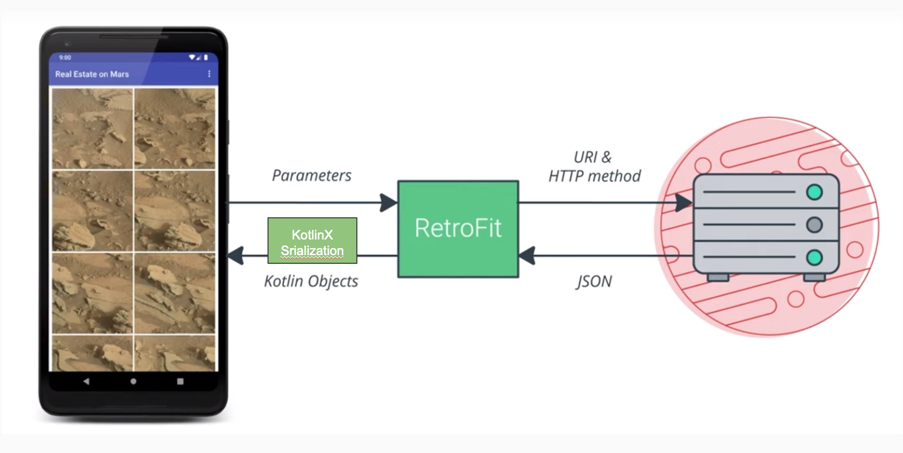

<!-- headingDivider: 2 -->
<!-- class: invert -->

# L'internet

## HTTP

- GET
- POST/ PUT
- DELETE

REST

## Permissions

```xml
// Necessary to make HTTP requests
<uses-permission android:name="android.permission.INTERNET"/>
// Necessary to get wifi, ethernet or mobile data status
<uses-permission android:name="android.permission.ACCESS_NETWORK_STATE"/>
```

## Check Network

```kotlin
val connectionManager =
  getSystemService(Context.CONNECTIVITY_SERVICE) as ConnectivityManager

val networkInfo = connectionManager.activeNetworkInfo

if (networkInfo != null && networkInfo.isConnected) doNetworkStuff()
else textView.setText("No network connection available.")

val isWifiConnected =
  connectionManager.getNetworkInfo(ConnectivityManager.TYPE_WIFI).isConnected

val mobileConnected =
  connectionManager.getNetworkInfo(ConnectivityManager.TYPE_MOBILE).isConnected
```

## Request a server



## Build a URI

the old way

```kotlin
val BASE_URL = "https://www.googleapis.com/books/v1/volumes?"
val QUERY_PARAM = "q"
val MAX_RESULTS = "maxResults"
val PRINT_TYPE = "printType"
val uri = Uri.parse(BASE_URL).buildUpon()
  .appendQueryParameter(QUERY_PARAM, "pride+prejudice")
  .appendQueryParameter(MAX_RESULTS, "10")
  .appendQueryParameter(PRINT_TYPE, "books").build()
val requestURL = URL(uri.toString())
```

## Parsing JSON

with KotlinX Serialization

```kotlin
val movieJson = """{
  \"id\": 19404,
  \"title\":
  \"Example Movie\",
  \"image_path\":\"/example-movie-image.jpg\"
}"""

@Serializable
data class Movie (
  val id: Int,
  val title: String,
  @SerialName("image_path")  
  val imagePath: String?= null,
)
```

## HTTP Client

with OkHttp

```kotlin
private val okHttpClient by lazy {
  OkHttpClient.Builder()
    .addInterceptor { chain ->
      val newRequest = chain.request().newBuilde()
        .addHeader("Authorization", "Bearer $TOKEN")
        .build()
      chain.proceed(newRequest)
    }
    .build()
}
```

## Api Service

with Retrofit

```kotlin
object MovieApi {
   private const val BASE_URL = "https://movies.com/API/"

   private val okHttpClient by lazy {...}

   private val jsonSerializer = Json {
      ignoreUnknownKeys = true
      coerceInputValues = true
  }

  private val converterFactory =
      jsonSerializer.asConverterFactory("application/json".toMediaType())

   private val retrofit = Retrofit.Builder()
      .client(okHttpClient)
      .baseUrl(BASE_URL)
      .addConverterFactory(converterFactory)
      .build()

   val movieService: MovieService by lazy { retrofit.create(MovieService::class.java) }
}

interface MovieService {
   @GET("movies/{user_id}")
   suspend fun getMovies(@Path("user_id") userId: String): Response<List<Movie>>
}
```
