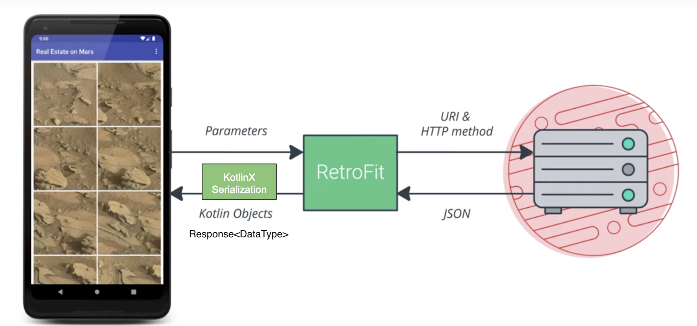

<!-- headingDivider: 2 -->

# L'internet

## HTTP


- GET: read data
- POST / PUT: write data
- DELETE: delete data

REST: Representational state transfer
CRUD: Create, Read, Update, Delete

## Build a URI

the old way

```kotlin
val BASE_URL = "https://www.googleapis.com/books/v1/volumes?"
val QUERY_PARAM = "q"
val MAX_RESULTS = "maxResults"
val PRINT_TYPE = "printType"
val uri = Uri.parse(BASE_URL).buildUpon()
  .appendQueryParameter(QUERY_PARAM, "pride+prejudice")
  .appendQueryParameter(MAX_RESULTS, "10")
  .appendQueryParameter(PRINT_TYPE, "books").build()
val requestURL = URL(uri.toString())
```

## Request a server



## HTTP Client

with OkHttp

```kotlin
private val okHttpClient =
  OkHttpClient.Builder()
    .addInterceptor { chain ->
      val newRequest = chain.request().newBuilde()
        .addHeader("Authorization", "Bearer $TOKEN")
        .build()
      chain.proceed(newRequest)
    }
    .build()
```

## Parsing JSON

with KotlinX Serialization

```kotlin
val movieJson = """{
  \"id\": 19404,
  \"title\":
  \"Example Movie\",
  \"image_path\":\"/example-movie-image.jpg\"
}"""

@Serializable
data class Movie (
  val id: Int,
  val title: String,
  @SerialName("image_path")  
  val imagePath: String? = null,
)

private val jsonSerializer = Json {
  ignoreUnknownKeys = true
  coerceInputValues = true
}

val converterFactory =
  jsonSerializer.asConverterFactory("application/json".toMediaType())
```

## Api Service

with Retrofit

```kotlin
val retrofit = Retrofit.Builder()
  .client(okHttpClient)
  .baseUrl(BASE_URL)
  .addConverterFactory(converterFactory)
  .build()

interface MovieWebService {
  @GET("movies/{user_id}")
  fun getMovies(@Path("user_id") userId: String): List<Movie>
}

// Create an object that implements MovieWebService
val movieWebService: MovieWebService = retrofit.create(MovieWebService::class.java)

// Pseudo-code equivalent:
val movieWebService = object : MovieWebService {
    override fun getMovies(userId: String) : List<Movie> {
      val json = okHttpClient.get("$BASE_URL/movies/$userId")
      return converterFactory.convert<List<Movie>>(json)
    }
}

// Usage:
val movies = movieWebService.getMovies("myUserId")
```

## Config

Full implementation example:

```kotlin
object MovieApi {
  private const val BASE_URL = "https://movies.com/API/"

  private val okHttpClient =
    OkHttpClient.Builder().addInterceptor { chain ->
        val newRequest = chain.request().newBuilde().addHeader("Authorization", "Bearer $TOKEN").build()
        chain.proceed(newRequest)
      }.build()

  private val jsonSerializer = Json {
    ignoreUnknownKeys = true
    coerceInputValues = true
  }

  val converterFactory =
    jsonSerializer.asConverterFactory("application/json".toMediaType())

  val retrofit = Retrofit.Builder()
    .client(okHttpClient)
    .baseUrl(BASE_URL)
    .addConverterFactory(converterFactory)
    .build()

   val movieWebService: MovieWebService = retrofit.create(MovieWebService::class.java)
}
```

## Permissions

```xml
// Necessary to make HTTP requests
<uses-permission android:name="android.permission.INTERNET"/>
// Necessary to get wifi, ethernet or mobile data status
<uses-permission android:name="android.permission.ACCESS_NETWORK_STATE"/>
```

## Check Network

```kotlin
val connectionManager =
  getSystemService(Context.CONNECTIVITY_SERVICE) as ConnectivityManager

val networkInfo = connectionManager.activeNetworkInfo

if (networkInfo != null && networkInfo.isConnected) doNetworkStuff()
else textView.setText("No network connection available.")

val isWifiConnected =
  connectionManager.getNetworkInfo(ConnectivityManager.TYPE_WIFI).isConnected

val mobileConnected =
  connectionManager.getNetworkInfo(ConnectivityManager.TYPE_MOBILE).isConnected
```
