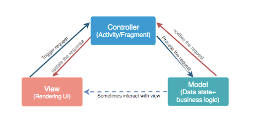
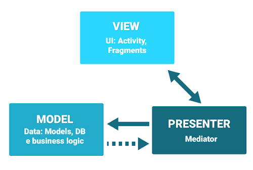
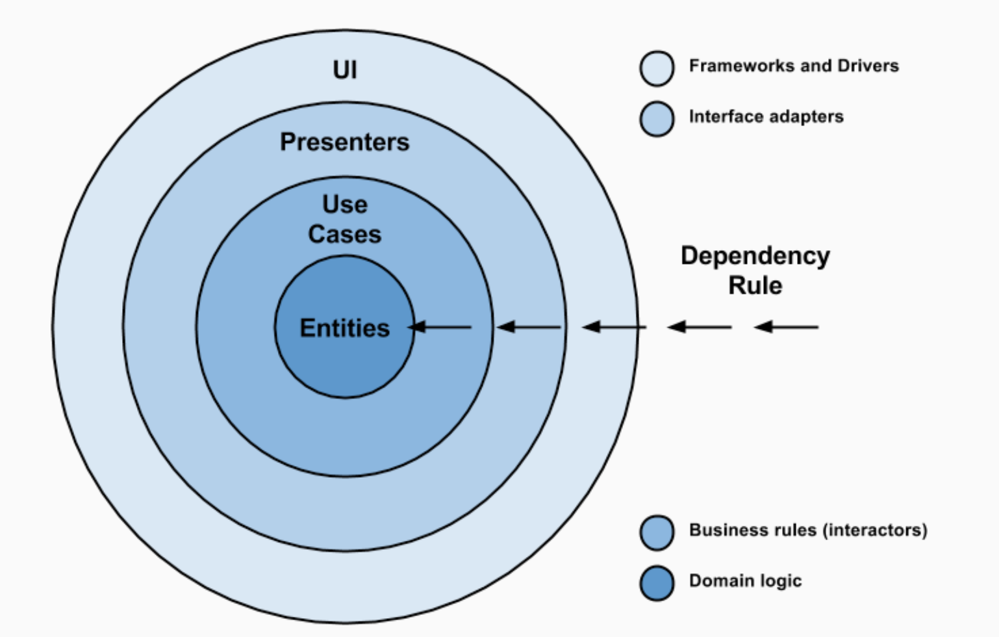
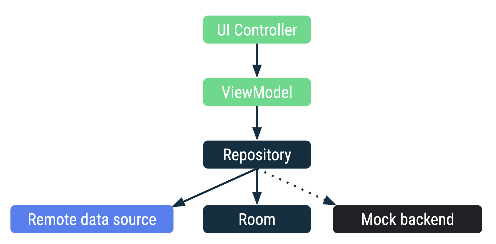

<!-- headingDivider: 2 -->
<!-- class: invert -->

# Architecture

## MVC

## MVP

## Dependecy Rule

## Clean Architecture

# MVVM

## ViewModel

- Formatte les données pour l'UI
- Survis aux configuration changes
- Peut aussi partager des données entre Fragments
- Fait partie lifecycle library
- Ne pas passer de Context (si besoin, étendre AndroidViewModel)

Analogie: Serveur

## Repository

- Pas un Architecture Components mais une bonne pratique
- Récupère les données d'une ou plusieurs `DataSource`
- Choisis la source en fonction des circonstantces
- Synchronise les sources
- Présente les données

Analogie: Cuisine
