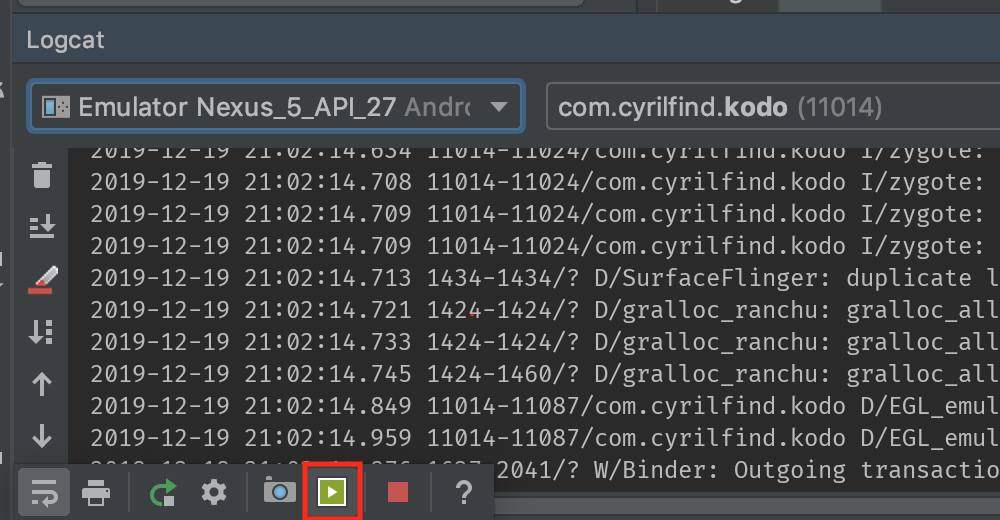

# IIM - Android

**But du cours**: connaître les bases du développement Android et notamment:

- Se familiariser avec Kotlin
- Prendre en main Android Studio et le Layout Editor
- Intéragir avec des `View`
- Implémenter une `RecyclerView`
- Intéroger une API distante

## Déroulement

6 séances avec un minimum de "Cours Magistral" et un maximum de TDs:

- TD 1: Kotlin Koans & Codelabs
- TD 2: RecyclerView
- TD 3: Actions & Intents
- TD 4: Internet
- TD 5: Architecture Components
- TD 6: Images & Permissions
- TD 7: SignUp/Login et Navigation

## Évaluation

L'évaluation se fera sur un rendu de projet par groupe de 2 sous la forme suivante:
- Une vidéo d'environ 1 minute démontrant le fonctionnement de votre app 
- Un lien vers votre projet git

### La vidéo:

Cherchez le bouton vert dans le volet "Logcat" pour enregistrer

- Il faut montrer toutes les features que vous avez implémentées (lister, ajouter, supprimer, etc...)
- Il faut que vous fassiez une rotation d'écran après avoir fait des actions sur votre liste
- Il faut qu'on voie un signe distinctif dans votre app pour ne veux pas avoir que des apps identiques: affichez au moins un nom quelquepart (celui récupéré du serveur par ex c'est parfait), votre avatar si vous l'avez fait ou alors personalisez un peu le design.

### Délai
Avant le 4 Janvier minuit

### Barême indicatif

- Note "participation/avancement" en TD:
    - L'app se lance et affiche une liste de tâches / 5
    - Intéraction avec le serveur: / 10
        - Lister
        - Supprimer
        - Ajout simple
    - Architecture MVVM (TD-5) / 5

    - Features en plus: / + 2 pour chaque
        - Ajout Complet
        - Édition
        - Propreté

- Note "autonomie": 
    - TD-6 / 20
    - TD-7 / 20
    - Bonus +2: Rafraichir la liste avec un `SwipeRefreshLayout`
    - Bonus +2: Ajouter un `PreferenceScreen` pour changer la couleur d'affichage par ex

L'idée de la note d'autonomie est que vous aurez une bonne note si vous finissez au moins un des deux TDs ou si vous faites une bonne moitié de chaque.

### Liens

- Discord pour poser des questions: [https://discord.gg/rY6BU8Y](https://discord.gg/rY6BU8Y)

- Évaluation et retours:
    - Groupe du matin: [http://bit.ly/201219-cyril1 ](http://bit.ly/201219-cyril1)
    - Groupe du soir: [http://bit.ly/201219-cyril2 ](http://bit.ly/201219-cyril2)
