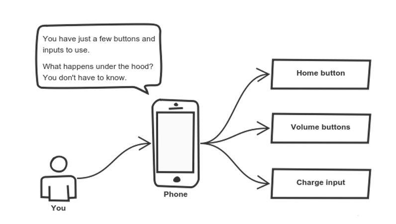

<!-- headingDivider: 2 -->

# OOP: Object Oriented Programming

## Vocabulary

- Type, Primitive, Class, Instance, Generics
- Variable, Function, Property, Method
- Inherit, Override, Implement, Abstract

## Principles

- Encapsulation
- Abstraction
- Inheritance
- Polymorphism

## Encapsulation

Hide the internal state


## Encapsulation: Example

```kotlin
class Cat {
    private var lives = 9

    public fun die() {
        if (lives > 0) lives--
        else print("🙀💀")
    }
}

```

## Abstraction

Expose high level handles



## Abstraction Example

```kotlin
class CoffeeMachine {
    private var isWaterHot = false
    private fun makeEspresso() { ... }
    private fun makeLatte() { ... }
    //...

    public fun makeCoffee(coffeeType: CoffeeType) {
        when(coffeeType) {
            Espresso -> makeEspresso()
            Latte -> makeLatte()
            //...
        }
    }
}
```

## Inheritance

Extend an other Class


## Inheritance Example

```kotlin
class Animal {
    fun eat() {
        print("nom nom")
    }
}

class Cat : Animal {
    var isBored = false
    override fun eat() {
        if (isBored) {
            super.eat()
        }
    }
}
```

## Interface

```kotlin
interface FriendsDataSource {
    val url: String
    fun getFriends() : List<Friend>
}

class TwitterFriendsDataSource : FriendsDataSource {
    override val url = "https://twitter.com/friends"
    override fun getFriends() : List<Friend> {
        // request from Twitter
    }
}

class FacebookFriendsDataSource : FriendsDataSource {
    override val url = "https://facebook.com/friends"
    override fun getFriends() : List<Friend> {
        // request from Facebook
    }
}
```

## Abstract class

```kotlin
abstract class FriendsDataSource {
    abstract val url: String
    fun getFriends() : List<Friend> {
        return emptyList()
    }
}

class TwitterFriendsDataSource : FriendsDataSource {
    override val url = "https://twitter.com/friends"
    override fun getFriends() : List<Friend> {
        // request from Twitter
    }
}

class FacebookFriendsDataSource : FriendsDataSource {
    override val url = "https://facebook.com/friends"
    override fun getFriends() : List<Friend> {
        // request from Facebook
    }
}
```

## Polymorphism

Use the same code for different types


## Polymorphism example

```kotlin
fun calculateTotalSurface(figures: List<Figure>) : Int {
    var totalSurface = 0
    figures.forEach { figure ->
        totalSurface += figure.calculateSurface()
    }
    return totalSurface
}
```

## SOLID principles

- Single-responsibility: A class should have a single responsibility
- Open–closed: open for extension, closed for modification
- Liskov substitution: No changes when replacing objects by their subtypes
- Interface segregation: Prefer several specific interfaces to a general one
- Dependency inversion: Depend upon abstractions, not concretions

## Other Principles

- DRY: Don't Repeat Yourself
- YAGNI: You Are Not Gonna Need It
- KISS: Keep it simple, stupid
- SSOT: Single source of truth

## Going Further

- Design Patterns (Singleton, Factory, ...)
- Dependency Injection
- Is Inheritance bad ?
- Often prefer composition: "has-a" VS "is-a"
- Entity Component System
- OOP is not a silver bullet

## Other Paradigms

- Procedural Programming
- Functional Programming
- Data Oriented Design
- Reactive Programming

## Links

- [How to explain object-oriented programming concepts to a 6-year-old](https://medium.freecodecamp.org/object-oriented-programming-concepts-21bb035f7260)
- [OOP](https://en.wikipedia.org/wiki/Object-oriented_programming)
- [SOLID](https://en.wikipedia.org/wiki/SOLID)
- [Uncle Bob's blog](https://blog.cleancoder.com/)
- [Brian Will's site (OOP critics, Game Development, Programming lessons)](https://brianwill.github.io/)
