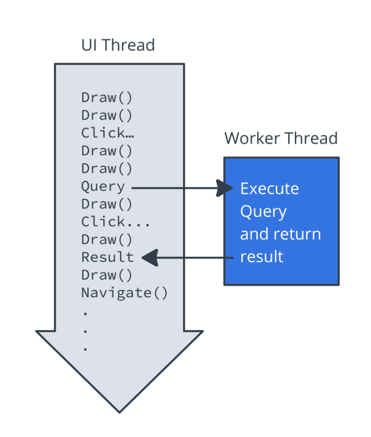

<!-- headingDivider: 2 -->

# Background work

## Threads



## Coroutines


- Coroutines are asynchronous and non-blocking.
- Coroutines use suspend functions to make asynchronous code sequential.

## Couroutine Context

Coroutines always execute in some `CoroutineContext`: a set of various elements, mainly its `Job` and its `CoroutineDispatcher`

## Scope

A coroutine's scope defines the context in which the coroutine runs.

- A scope combines information about a coroutine's `Job` and `CoroutineDispatcher`
- Scopes keep track of coroutines that are “in them”

➡️ actually just a wrapper around a `CoroutineContext`, can be seen as a "parent context"

ex: `GlobalScope`, `MainScope`, `viewModelScope`, `lifeCycleScope`

## Job

Basically, a `Job` is anything that can be canceled

- Every coroutine has a `Job`, and you can use it to cancel the coroutine
- Jobs can be arranged into parent-child hierarchies
- Canceling a parent job immediately cancels all the job's children

```kotlin
fun main() {
    val job = GlobalScope.launch { 
        // do something long
    }
    if (input == `^C`) job.cancel()
}
```

## Dispatcher

The `CoroutineDispatcher` sends off coroutines to run on various threads

ex: `Dispatcher.Main` runs tasks on the main thread, `Dispatcher.IO` offloads blocking I/O tasks to a shared pool of threads

```kotlin
fun main() {
    GlobalScope.launch(Dispatchers.IO) { 
        // do something long on IO thread
    }
}
```

## Suspending

Suspend functions are only allowed to be called from a coroutine or another suspend function

```kotlin
suspend fun doSomethingLong() { 
    // request server, DB, filesystem, ...
}

fun main() {
    doSomethingLong() // ❌ KO 

    GlobalScope.launch { 
        doSomethingLong() // ✅ OK
    }
}

suspend fun otherSuspendFunction() {
    doSomethingLong() // ✅ OK
}
```

## Usage

```kotlin
val job = scope.launch { /* Do something long */ }
job.join() // wait for work to finish
job.cancel() // cancel work

val result: Deffered<SomeClass> = scope.async {
    mySuspendFun()
}
val result: SomeClass = result.await() // wait for result data
```

## Usage on Android

```kotlin
// in Repository
suspend fun getData() : Int = withContext(Dispatchers.IO) {  
    // execute long IO operation
}

// in ViewModel
viewModelScope.launch { // canceled when ViewModel is destroyed
    repository.getData()
}


// in Fragment or Activity
lifecycleScope.launch { // canceled when fragment is destroyed
    whenStarted { /* starts when fragment is in started state */ }
    // the rest executes after the whenStarted block
}
lifecycleScope.launchWhenStarted { /* launches when fragment is in started state */ }
```

## Observer pattern

Design pattern that allows decoupling actions and data consumption by decoupling the *observable* (or subject) from the *observers* (or listeners):

```kotlin
val observable: Observable<Data>

observable.notify(data)

observable.observe { data -> /* use the value */ }
```

## LiveData

example of Observable on Android:

```kotlin
// in a ViewModel
private val _userLiveData = MutableLiveData<User>(default)
public val userLiveData: LiveData<User> = _userLiveData

fun refreshUser() {
    viewLifecycleScope.launch {
        _userLiveData.value = fetchUser()
    }
}

// in a fragment or activity
viewModel.userLiveData.observe(viewLifecycleOwner) { user ->
    userNameTextView.text = user.userName
}
```

## Reactive Streams

Represent data as a async sequence that can be Observed

```kotlin
val stream = Stream.of("red", "white", "blue")
    .map(String::toUpperCase)
    .subscribeOn(Schedulers.newParallel("sub"))
    .publishOn(Schedulers.newParallel("pub"), 2)

stream.subscribe { value ->
    log(value)
}
```

Streams can be "hot" or "cold" (analogy: Radio // CD)

## Flow

Implementation of reactive streams based on coroutines:

```kotlin
val flow: Flow<String> = listOf("red", "white", "blue").asFlow() 
            .map { it -> it.ToUpperCase() }
            .flowOn(Dispatchers.Default)

scope.launch {
    flow.collect { response -> println(response) }
}
```

## Mutable Flow

Special type of flow used like `LiveData`

```kotlin
// repository
private val _userFlow = MutableFlow<NetworkUser>()
public val userFlow: Flow<NetworkUser> = _userFlow

suspend fun refreshUser() {
    _userFlow.value = fetchUser()
}

val adaptedUserFlow : Flow<User> = repository.userFlow
    .map { ... }
    .onEach { ... }
}

someScope.launch {
    adaptedUserFlow.collect {
        // ...
    }
}
```
