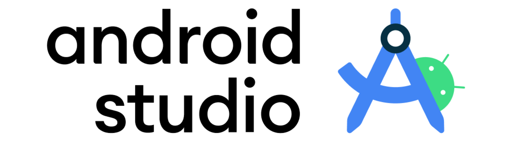
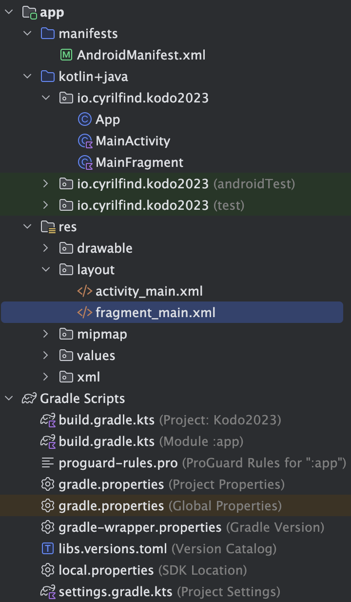

<!-- headingDivider: 2 -->

# Android

## Intro

- Nombreux utilisateurs
- Devices très différents
- Versions d’OS anciennes
- Play Store
- Puissance limitée
- Phone, Tablet, TV, Watch, Auto, Chrome, Windows, ...
- Dev natif en Kotlin et Java

## Android Studio

- IDE dédié
- Développé par Jetbrains (IntelliJ)
- Navigation projet
- "Sync Now"
- Logcat
- Émulateurs
- SDK Manager
- strings.xml
- Refactoring
- RAM 🔥

## Éléments d'une app Android

- Scripts Gradle: build logic
  - minSdk, compileSdk, targetSdk
  - implementations, libs TOML
  - versionCode, versionName
- AndroidManifest.xml
- App
- Activity
- Fragment
- Layouts XML
- Components

## App Components

- Activity / Fragments ➡ Screen Controller
- Service ➡ Headless Controller
- Broadcast Receiver ➡ Event Listener
- ContentProvider ➡ Shared Data API

## Android Studio: Démo

## iOS

- Beaucoup d'utilisateurs aux US
- Plus de 💰 dépensés
- Moins de devices différents
- OS mis à jour plus rapidement
- App Store
- Swift (interop Objective-C)
- XCode 💩
- Simulator

## Xcode: Démo

## Composants et Cross-Platform

- Permet de coder une seule fois
- Souvent à base de "Components" (à la React)
- Désavantage: performances, UX, possibilités spécifiques ou récentes des OS
- Xamarin, ReactNative, NativeScript, Ionic, ...
- Dart: Flutter (iOS, Android, Desktop, Web) par Google

## Composants natifs

- Swift: SwiftUI par Apple
- Kotlin: Jetpack Compose sur Android, Desktop, Web et même iOS par JetBrains et Google
