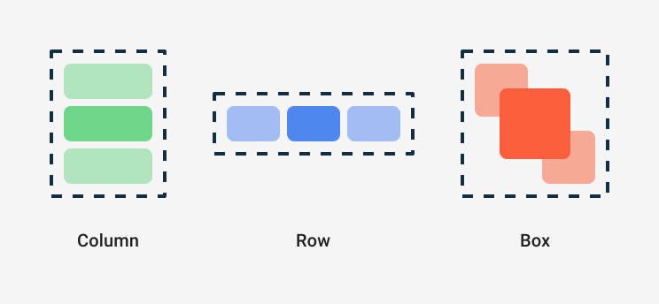
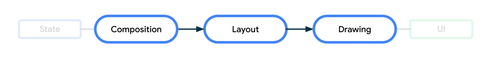
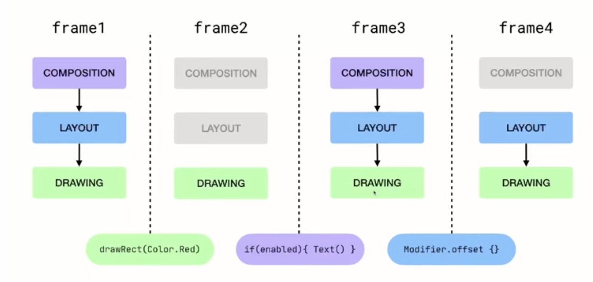
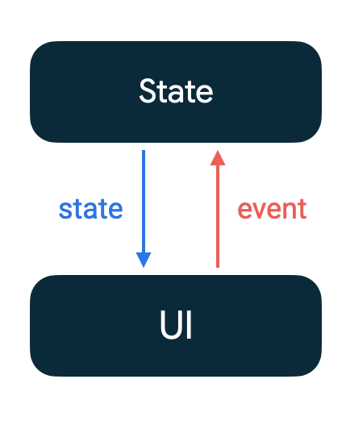

<!-- headingDivider: 2 -->

# Jetpack Compose


## Layout Tree

```kotlin
@Composable
fun MyComposable() {
    Column(Modifier.fillMaxWidth()) {
        Text("Hello")
        Text(
          text = "World",
          style = Typo.small
        )
    }
}
```


## Syntax

Kotlin Compiler Plugin: exécution en désordre, en parallèle, skips, ...
➡️ En gros: comme une boucle de rendu, avec des optimisations

```kotlin
var number = 1

// Imperative code doesn't make sense in @Composable
@Composable
fun MyComposable() {
    number++ // ❌
    Button(
      onClick = { number++ } // ✅
    ) { ... }
}

// @Composable can only be called in a @Composable scope
fun normalFunction() {
  MyComposable() // ❌ doesn't compile
}
```

## Base components

```kotlin
Surface() // colored background
Text("hello")
Image(
  painter = painterResource(id = R.drawable.ic_close),
  contentDescription = "Close"
)
Spacer(modifier = Modifier.weight(1f, fill = true))
```

## Containers



```kotlin
Column { /* ColumnScope */
  Text(modifier = Modifier.align(Alignment.CenterHorizontally), text = "hello")
  Text("world")
}
Row { /* RowScope */
  Text(modifier = Modifier.align(Alignment.CenterVertically), text = "hello")
  Text("world")
}
Box { /* BoxScope */ }
BoxWithConstraints { /* defined measurements like: $minHeight, $maxHeight, etc */ }
```

## ConstraintLayout

```kotlin
ConstraintLayout {
  val (hello, world) = createRefs()
  Text(
    text = "Hello"
    modifier = Modifier.constrainAs(hello) { top.linkTo(parent.top, margin = 16.dp) },
  )
  Text(
    text = "World",
    modifier = Modifier.constrainAs(world) { top.linkTo(hello.bottom, margin = 16.dp) }
  )
}
```

## Lazy lists

```kotlin
val listState = rememberLazyListState()
LazyRow(state = listState) { ... }

val words = listOf("Hello", "world", "!")
LazyColumn {
    items(words) { word -> Text(word) }
}

LazyVerticalGrid(columns = GridCells.Fixed(count = COLUMN_COUNT)) { ... }

val elements = viewModel.pagedElements.collectAsLazyPagingItems()
LazyHorizontalGrid(...) { items(elements) { ... } }
```

## Slots API


```kotlin
@Composable
fun TopAppBar(
  title: @Composable () -> Unit,
  navigationIcon: @Composable (() -> Unit)? = null,
  actions: @Composable RowScope.() -> Unit = {},
)

// usage
TopAppBar(
  title = { Text(text = "Title") },
  actions = { IconButton(onClick = { /* doSomething() */ },
  navigationIcon = { Icon(Icons.Filled.Menu) },
)
```

## Lifecycle

```kotlin
var name by remember { mutableStateOf("") }
TextField(
    value = name,
    onValueChange = { name = it },
)
```

Sorte de lifecycle mais différent:

1. Composition
2. Recomposition ex: un `State<T>` a changé
3. Décomposition


## Étapes



- Parcours de l'arbre: en fonction du state et de l'imbrication des composants
- Placement des éléments: en fonction de l'arbre et de certains modifiers
- Rendu: en fonction de l'arbre, du placement et de certains modifiers

## Étapes: exemple



## State



```kotlin
var name: String = "name" // always reset
val name: State<String> = mutableStateOf("name") // observable
var name: String = remember { "name" } // survive recompositions
val name: State<String> = remember { mutableStateOf("name") } // both!

var name: String by remember { mutableStateOf("name") } // avoid `name.value`

// stateful
@Composable
fun StatefulTextField() {
    var name by remember { mutableStateOf("") }
    StatelessTextField(
        value = name,
        onNameChange = { name = it },
    )
}

// stateless
@Composable
fun StatelessTextField(name: String, onNameChange: (String) -> Unit) {
  TextField(
      value = name,
      onValueChange = onNameChange,
  )
}
```

## remembers

```kotlin
remember { ... }
remember(key) { ... }
rememberSaveable { Bundle(...) }
rememberLazyListState()
rememberCoroutineScope()
```

## Modifiers

L'ordre compte !

```kotlin
Text(
  text = "example",
  modifier = Modifier.fillMaxSize(0.5f) // 50% of parent
    .padding(8.dp) // margin
    .background(White) // applies after padding
    .padding(8.dp) // doesn't apply to white background
    .clickable { /* imperative code */ } // click zone is inside 2nd padding
)
```

## Exemple ❌


```kotlin
Text(
  text = "example",
  modifier = Modifier.padding(8.dp)
    .clickable {}
)
```

## Exemple ✅


```kotlin
Text(
  text = "example",
  modifier = Modifier.clickable {}
    .padding(8.dp)
)
```

## Navigation

```kotlin
val navController = rememberNavController()
NavHost(navController = navController, startDestination = "profile") {
    composable("friends") { Friends(...) } // simple route
    composable("post/{postId}") { Post(...) } // required argument
    composable("profile?userId={userId}") { Profile(...) } // optional argument
}
```

```kotlin
navController.navigate("post/123456")
```

## Side Effects

Une fonction `@Composable` qui n'émet pas d'UI mais exécute des effect quand la composition termine.

## SideEffect

Publish Compose state to non-compose code

```kotlin
SideEffect {
  // update metadata on every successful composition
  analytics.setUserProperty("userType", user.userType)
}
```

## DisposableEffect

effects that require cleanup

```kotlin
DisposableEffect(manager) {
  val listener = ...
  manager.addListener(listener) // setup something that needs cleanup

  onDispose { // called when leaving composition
      manager.removeListener(listener) // cleanup
  }
}
```

## LaunchedEffect

run suspend functions in the scope of a composable

```kotlin
if (state.hasError) { // only start when it's true and cancel if it's false
  LaunchedEffect(key = snackbarHostState) { // cancel and re-launch if state changes
      // auto dismiss when coroutine is cancelled
      snackbarHostState.showSnackbar(message = "Error message", actionLabel = "Retry message")
  }
}
```

## rememberCoroutineScope

obtain a composition-aware scope to launch a coroutine outside a composable

```kotlin
val listState = rememberLazyListState()
val coroutineScope = rememberCoroutineScope()

LazyColumn(state = listState) {
    // ...
}

Button (
  onClick = {
    coroutineScope.launch {
      listState.animateScrollToItem(index = 10)
    }
  }
) { ... }
```

## rememberUpdatedState

reference a value in an effect that shouldn't restart if the value changes

```kotlin
@Composable
fun LandingScreen(onTimeout: () -> Unit) {
  // always latest onTimeout function value
  val currentOnTimeout by rememberUpdatedState(onTimeout)

  // effect that matches the lifecycle of LandingScreen.
  // on recomposes, the delay shouldn't start again.
  LaunchedEffect(true) {
      delay(SplashWaitTimeMillis)
      currentOnTimeout()
  }
}
```

## CompositionLocal

```kotlin
val LocalElevations = staticCompositionLocalOf { Elevations() }
// ...
CompositionLocalProvider(LocalElevations provides Elevations(default = 1.dp, ...)) {
    // ...
    LocalElevations.current // access
}

```

## Theme

```kotlin
MaterialTheme(
  colorScheme = lightColorScheme(primary = ..., onPrimary = ...),
  typography = Typography(titleLarge = TextStyle(fontWeight = FontWeight.SemiBold, fontSize = 22.sp), ...),
  shapes = Shapes(small = RoundedCornerShape(8.dp), ...),
) { App()} // Composant qui s'applique sur toute l'app / chaque écran
```

- `MaterialTheme` est fourni par Google et permet de fournir définir des valeurs par défaut aux composants Material (à l'aide de Compositionlocal)
- On peut définir son propre Theme et ses propres Composants qui l'utilisent
- Cela permet de définir son propre Design System

## UI state

```kotlin
class LoginViewModel : ViewModel() {
    private val _uiState = MutableStateFlow<UiState>(UiState.SignedOut)
    val uiState: StateFlow<UiState>
        get() = _uiState
    fun signIn() {
        // ...
        _uiState.value = UiState.SignedIn
    }
}

@Composable
fun LoginScreen(viewModel: LoginViewModel) {
    val uiState by viewModel.uiState.collectAsState()
    when (uiState) {
        UiState.SignedOut -> Button(onClick = { viewModel.signIn() }) { Text("Sign in") }
        UiState.SignedIn -> Text("Signed in as ${uiState.userId}")
    }
}
```

## iOS: SwiftUI

```swift
struct AlbumDetail: View {
  var body: some View {
    VStack(alignment: .leading) {
      Text("Hello")
      Text("World")
        .foregroundStyle(.secondary)
    }
}
```
