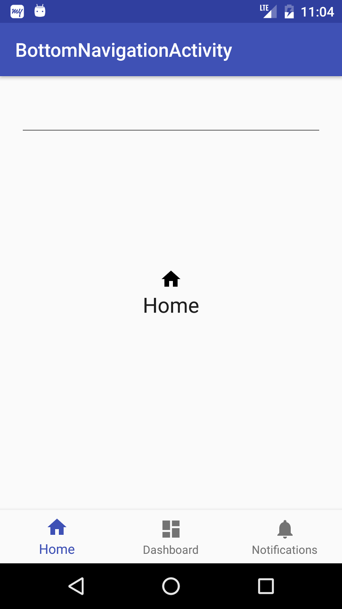
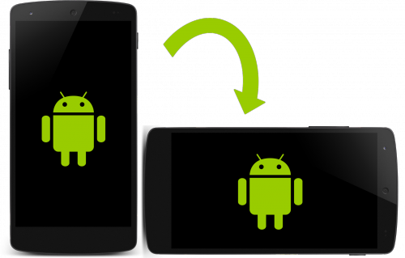

<!-- headingDivider: 2 -->

# UI Framework: Activities, Fragments, Lifecycle, Views

## Activity



- Contrôle une "page" qui prends généralement tout l’écran
- Son rôle est de créer, afficher, manipuler les `View` pour permettre à l'utilisateur d'interagir
- Obéit à un "Lifecycle"
- Peut contenir des `Fragment`
- Souvent une "Single Activity" dans laquelle on navigue en intervertissant des `Fragment`
- ⚠️ Éviter la tendance à mettre trop de logique dans l'Activity

## Context

Objet très présent sur Android:

- Fourni par le système
- Interface aux infos globales sur l'environnement de l'application
- Accède aux resources et aux classes spécifiques à l'application
- Permet de lancer des `Activity`
- Diffuse et reçoit des `Intents`
- `Activity` hérite de `Context` donc peut faire tout ça également

## Layouts

Fichier XML décrivant un écran (ou une partie)

```xml
<?xml version="1.0" encoding="utf-8"?>
<androidx.constraintlayout.widget.ConstraintLayout
  xmlns:android="http://schemas.android.com/apk/res/android"
  xmlns:app="http://schemas.android.com/apk/res-auto" >
    <androidx.cardview.widget.CardView >
        <TextView ... />
        <ImageView ... />
        <EditText ... />
        <Button ... />
    </androidx.cardview.widget.CardView>
</androidx.constraintlayout.widget.ConstraintLayout>
```

## Views

 Élément graphique de l’interface: Text, Image, Button, ...

```xml
<TextView
  android:id="@+id/textView_login" // reference to the view
  android:layout_width="match_parent" // use all available width in parent
  android:layout_height="wrap_content" // use only needed height
/>

<Button
  android:id="@+id/button_login"
  android:layout_width="0dp" // match width to constraints
  android:layout_height="200dp" // specify explicit height
  app:layout_constraintEnd_toEndOf="@id/textView_login" // constraint start
  app:layout_constraintStart_toStartOf="parent" // contraint end
  android:visibility="invisible" // visible, invisible or gone
/>
```

## ViewGroups

View contenant d’autres Views, avec diverses règles d’affichage:


## Inflating Layout in Activity

```kotlin
class MainActivity : AppCompatActivity() {
   override fun onCreate(savedInstanceState: Bundle?) {
       super.onCreate(savedInstanceState)
       setContentView(R.layout.activity_main) // inflate
//    access resources^ ^layouts   ^layout file name
}

class MainFragment : Fragment() {
  override fun onCreateView(...): View {
    return inflater.inflate(R.layout.fragment_main, container, false)
  }
}

```

## References to views


```kotlin
// traditional
val loginTextView: TextView = findViewById(R.id.textView_login)
val loginTextView = findViewById<TextView>(R.id.textView_login)

// ButterKnife
@BindView(R.id.textView_login) val loginTextView: TextView

// viewbinding / databinding
binding.textViewLogin
```

## ViewBinding

Dans `app/build.gradle`:

```gradle
android {
    buildFeatures {
        viewBinding true
    }
}
```

Usage:

```kotlin
// Dans `onCreate` ou `onCreateView`:
val binding = ActivityMainBinding.inflate(layoutInflater)
val rootView = binding.root

// pour manipuler les vues:
binding.textViewLogin.setOnCLickListener { ... }
```

[Documentation](https://developer.android.com/topic/libraries/view-binding#fragments)

## Declare main activity in manifest

```xml
// MainActivity needs to include intent-filter to start from launcher
<activity
      android:name=".MainActivity"
      android:label="@string/app_name"
      android:theme="@style/AppTheme.NoActionBar">
  <intent-filter>
      <action android:name="android.intent.action.MAIN"/>
      <category android:name="android.intent.category.LAUNCHER"/>
  </intent-filter>
</activity>
```

# Lifecycle Components

## Activity lifecycle


## Fragment lifecycle


## Configuration Changes



- Rotation
- Changement de langage
- Mode multi-fenêtre

Android garde seulement :

- L’intent éventuellement utilisé
- L’état des vues ayant un ID (ex: RecyclerView scroll position)

## InstanceState

```kotlin
override fun onSaveInstanceState(outState: Bundle) {
   super.onSaveInstanceState(outState)
   outState.putString("key", count_text_view.text.toString())
}


override fun onCreate(savedInstanceState: Bundle?) {
   super.onCreate(savedInstanceState)
   setContentView(R.layout.activity_main)
   savedInstanceState?.getString("key").let { count ->
       count_text_view.setText(count)
   }
}
```

- Préserve les données de l’Activity
- Configuré manuellement
- Perdu si on quitte l’Activity
- Plus persistent: DB, Web, SharedPreference, DataStore

# iOS


- UIViewController (Équivalent de Activity)
- Storyboards (Layout XML manipulé visuellement)
- Xibs (Vue XML)

```swift
class LoginViewController: UIViewController {
    @IBOutlet weak var label: UILabel!
    @IBAction func setDefaultLabelText(_ sender: UIButton) {
        let defaultText = "Default Text"
        label.text = defaultText
    }
}
```

## UIViewController


- Layout:
  - StoryBoard
  - Nib (`init(nibName:bundle:)`)
  - `loadView`, `viewDidLoad`, ...
- rotation: `viewWillTransition`
- state restauration: `restorationIdentifiers` on VC and Views

## Jetpack Compose: Layouts

```kotlin
@Composable
fun MyComposable() {
    Column(Modifier.fillMaxWidth()) {
        Text("Hello")
        Text("World")
    }
}
```


## Jetpack Compose: remember & state
```kotlin
Column(modifier = Modifier.padding(16.dp)) {
    var name by remember { mutableStateOf("") }
    TextField(
        value = name,
        onValueChange = { name = it },
        label = { Text("Name") }
    )
}
```

## Jetpack Compose: Lifecycle


Beaucoup plus simple:

- une première Composition quand le composant apparaît à l'écran
- une Recomposition à chaque fois que c'est nécessaire: en général lorsqu'un `State<T>` a changé de valeur
- le composant quitte l'écran

⚠️ C'est en fait un lifecycle de nature très différente
