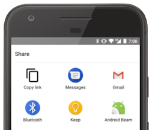
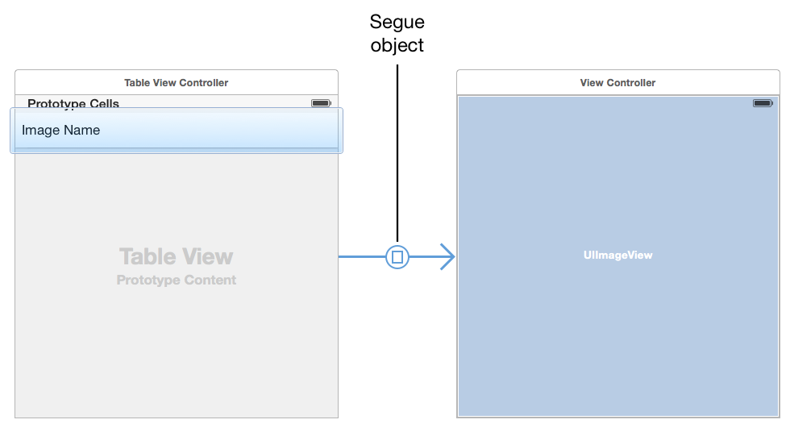

<!-- headingDivider: 2 -->
<!-- TODO: Deeplinks ? -->

# Intents

## Définition


Objet "lancé" par une app ou le système qui contient les infos pour démarrer une `Activity` (`Service`, `Broadcast` plus rarement)

## Explicite


```kotlin
val explicitIntent = Intent(context, MyActivity::class.java)

startActivity(intent)
```

## Implicite


```kotlin
val urlIntent = Intent("http://www.google.com")
val callButtonIntent = Intent(ACTION_CALL_BUTTON)
val phoneIntent = Intent(ACTION_DIAL, "tel:8005551234")
val searchIntent = Intent(Intent.ACTION_WEB_SEARCH)
searchIntent.putExtra(SearchManager.QUERY, "cute cat pictures")

val createPdfIntent = Intent(ACTION_CREATE_DOCUMENT)
createPdfIntent.type = "application/pdf" // set MIME type
createPdfIntent.addCategory(CATEGORY_OPENABLE)
```

## Send / Receive data

```kotlin
// Preparing intent in FirstActivity
val intent = Intent(this, SecondActivity::class.java)

intent.data = Uri.parse("https://www.google.com") // Web URL
intent.data = Uri.fromFile(File("/file_path/file.jpg")) // File URI

intent.putExtra("level_key", 42)
intent.putExtra("food_key", arrayOf("Rice", "Beans", "Fruit"))

startActivity(intent)

// Receiving data in SecondActivity
val uri = intent.data
val level = intent.getIntExtra("level_key", 0) // default to 0
val food = intent.getStringArrayExtra("food_key")
```

## Resolving intents

```kotlin
// Check if that intent can be handled !
if (intent.resolveActivity(packageManager) != null) {
   startActivity(intent) // if no result needed, otherwise: ↴
}
```


## Using Chooser Intent / Sharesheet



```kotlin
// using Chooser Intent / Sharesheet
val intent = Intent(Intent.ACTION_SEND)
val chooserIntent = Intent.createChooser(intent, "Chooser Title")
   startActivity(chooserIntent)
```

## Intent Filters

```xml
<activity android:name="ShareActivity">
    <intent-filter>
        <action android:name="android.intent.action.SEND" />
        <action android:name="android.intent.action.SEND_MULTIPLE"/>
        <category android:name="android.intent.category.DEFAULT" />
        <data android:mimeType="text/plain" />
        <data android:mimeType="image/*" />
        <data android:mimeType="video/*" />
    </intent-filter>
</activity>
<activity android:name="BrowserActivity">
    <intent-filter>
        <action android:name="android.intent.action.VIEW" />
        <category android:name="android.intent.category.BROWSABLE" />
        <data android:scheme="https" />
        <data android:host="developer.android.com" />
    </intent-filter>
    <intent-filter>
        <intent-filter>
            <action android:name="android.intent.action.MAIN" />

            <category android:name="android.intent.category.LAUNCHER" />
        </intent-filter>
    </intent-filter>
</activity>
```

## Requesting

```kotlin
class FirstActivity : Activity() { // requesting Activity
    val startForResult = registerForActivityResult(StartActivityForResult()) { result ->
    if (result.resultCode == Activity.RESULT_OK) // use result.data
}
    fun onUserStartedSomething() {
        startForResult.launch(Intent(this, SecondActivity::class.java))
    }
}

class SecondActivity : Activity() {
    fun onUserFinishedSomething() { // ...
        intent.putExtra("reply_key", "reply data") // add result data to intent
        setResult(RESULT_OK, intent) // specify all went well and return the data
        finish() // close this activity
    }
}
```

[Creating a custom contract](https://developer.android.com/training/basics/intents/result#custom)

## Default ActivityResultContracts

Exemple:

```kotlin
val getContent = registerForActivityResult(GetContent()) { uri ->  ... }

getContent.launch("image/*")
```

[Documentation](https://developer.android.com/reference/androidx/activity/result/contract/ActivityResultContracts)

# Permissions

- Demandées “à la volée” depuis Android M
- Les permissions “dangereuses” doivent être demandées à chaque fois
- On recommande d’expliquer la raison avant (et après un refus)
- Ajouter dans le manifest:
  `<uses-permission android:name="android.permission.CAMERA" />`
- Vérifier si la permission a été donnée
- La demander sinon (éventuellement demander à devenir app par défaut)
- Éxecuter l’action ou expliquer pourquoi elle est impossible en cas de refus

## Example

```kotlin
// Register the permissions callback
val requestPermissionLauncher =
        registerForActivityResult(RequestPermission()) { isGranted ->
            if (isGranted) // Permission is granted
            else // Explain required permission the user denied
    }

// Checking for a permission, and requesting a permission from the user when necessary
when {
    ContextCompat.checkSelfPermission(context, Manifest.permission.CAMERA)
        == PackageManager.PERMISSION_GRANTED -> {
        // You can use the API that requires the permission.
    }
    shouldShowRequestPermissionRationale(...) -> {
        // Explain to the user why your app requires this permission
    }
    else -> {
        // ask for the permission
        requestPermissionLauncher.launch(Manifest.permission.CAMERA)
    }
}
```

# iOS

## iOS: Segues



```swift
self.performSegue(withIdentifier: "SECOND_SCREEN_SEGUE", for sender: self)
```

[Documentation](https://developer.apple.com/library/archive/featuredarticles/ViewControllerPGforiPhoneOS/UsingSegues.html)

## iOS: Demander un résultat

On fait des delegate à la main:

```swift
protocol ImageDelegate{
  func onImageReceived(_ picker: ImagePickerController, didReceiveValue value: UIImage)
  func onCancel(_ picker: ImagePickerController)
}

class TakePictureController : UIViewController, ImageDelegate{ ... }
```

## iOS: Share Extensions

Plus compliqué: Il faut crér un module à part avec son propre `ViewController`

Les capabilities sont dans un fichierde configuration (plist):


## iOS: Permissions

Beaucoup plus simple: on définit quelques textes dans des fichiers de configuration, ils seront utilisés pour remplir la popup quand l'OS l'estime nécessaire
