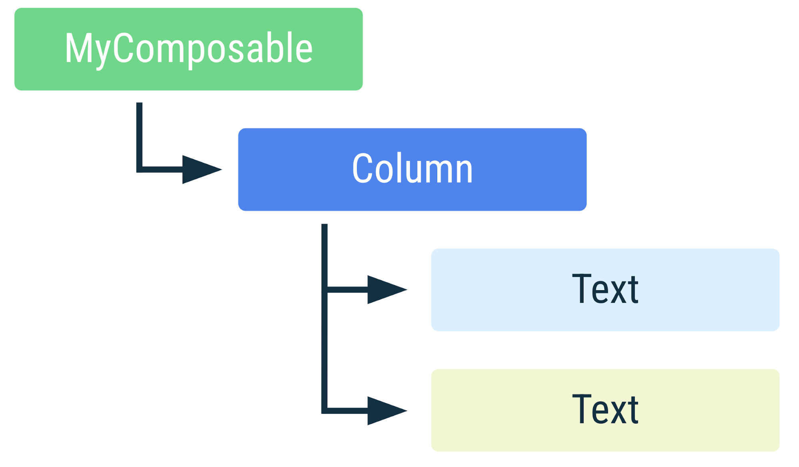

<!-- headingDivider: 2 -->

# Jetpack Compose


## Layout Tree

```kotlin
@Composable
fun MyComposable() {
    Column(Modifier.fillMaxWidth()) {
        Text("Hello")
        Text(
          text = "World",
          style = Typo.small
        )
    }
}
```



## Syntax

Kotlin mais compilé autrement: exécution en désordre, en parallèle, skips, ...
➡️ Pour simplifier: considérer ça comme une loop de rendu (jeux vidéos)

```kotlin
var number = 1

// Imperative code doesn't make sense in @Composable
@Composable
fun MyComposable() {
    number++ // ❌
    Button(
      onClick = { number++ } // ✅
    ) { ... }
}

// @Composable can only be called in a @Composable scope
fun normalFunction() {
  MyComposable() // ❌ doesn't compile
}
```

## Base components (foundation)

```kotlin
Surface() // colored background
Text("hello")
Image(painter = painterResource(id = R.drawable.ic_close))
Column { /* ColumnScope */ }
Row { /* RowScope */ }
Box { /* BoxScope */ }
BoxWithConstraints { /* defined measurements like: $minHeight, $maxHeight, etc */ }
Spacer(modifier = Modifier.weight(1f, fill = true))
```

## State

```kotlin
val name = "name" // will always reset
var name = mutableStateOf("name") // observable but will still always reset
var name = remember { mutableStateOf("name") } // observable and survives recompositions
var name by remember { mutableStateOf("name") } // simplifies syntax instead of using `name.value`

TextField(
    value = name,
    onValueChange = { name = it },
)
```

## Lifecycle

```kotlin
var name by remember { mutableStateOf("") }
TextField(
    value = name,
    onValueChange = { name = it },
)
```

Sorte de lifecycle mais différent:

1. Composition
2. Recomposition ex: un `State<T>` a changé
3. Décomposition


## Lazy lists

```kotlin
val listState = rememberLazyListState()
LazyRow(state = listState) { ... }

val words = listOf("Hello", "world", "!")
LazyColumn {
    items(words) { word -> Text(word) }
}

LazyVerticalGrid(columns = GridCells.Fixed(count = COLUMN_COUNT)) { ... }

val elements = viewModel.pagedElements.collectAsLazyPagingItems()
LazyHorizontalGrid(...) { items(elements) { ... } }
```

## modifiers

order matters!

```kotlin
Text(
  text = "example",
  modifier = Modifier.fillMaxSize(0.5f) // 50% of parent
    .padding(8.dp) // margin
    .background(White) // applies after padding
    .padding(8.dp) // doesn't apply to white background
    .clickable { /* imperative code */ } // click zone is inside 2nd padding
)_
```

## remembers

```kotlin
remember { Color.random() }
rememberSaveable { Bundle("key" to parcelableValue)}
remember(key) { }
rememberLazyListState()
rememberCoroutineScope()
```

# Side Effects

<https://developer.android.com/jetpack/compose/side-effects>

## SideEffect

publish Compose state to non-compose code

```kotlin
SideEffect {
  //
}
```

## DisposableEffect

effects that require cleanup

```kotlin
DisposableEffect(manager) {
  val listener = ...
  manager.addListener(listener) // setup something that needs cleanup

  onDispose { // called when leaving composition
      manager.removeListener(listener) // cleanup
  }
}
```

## LaunchedEffect

run suspend functions in the scope of a composable

```kotlin
if (state.hasError) { // only start when it's true and cancel if it's false
  LaunchedEffect(key = snackbarHostState) { // will cancel and re-launch if state changes
      // when the coroutine is cancelled the snackbar will automatically dismiss.
      snackbarHostState.showSnackbar(message = "Error message", actionLabel = "Retry message")
  }
}
```

## rememberCoroutineScope

obtain a composition-aware scope to launch a coroutine outside a composable

## rememberUpdatedState

reference a value in an effect that shouldn't restart if the value changes

## CompositionLocalProvider

## ProvideTextStyle

## Collect

```kotlin
flow, livedata
```

## navigation

```kotlin
val navController = rememberNavController()
NavHost(navController = navController, startDestination = "profile") {
    composable("friends") { Friends(...) } // simple route
    composable("post/{postId}") { Post(...) } // required argument
    composable("profile?userId={userId}") { Profile(...) } // optional argument
}
```

```kotlin
navController.navigate("post/123456")
```

## theme

```kotlin

```

## design system

```kotlin

```

## slots

```kotlin

```

## Design system

- showkase

## example (tab bar avec contenu lazy)

```kotlin

```

## ui model

```kotlin

```

## iOS: SwiftUI

```swift
struct AlbumDetail: View {
  var body: some View {
    VStack(alignment: .leading) {
      Text("Hello")
      Text("World")
        .foregroundStyle(.secondary)
    }
}
```
