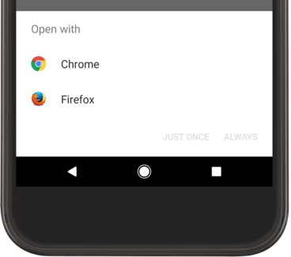

<!-- headingDivider: 2 -->
<!-- TODO: Deeplinks ? -->

# <!-- fit --> Intents


## Définition


Objet qui contient les infos pour trouver et démarrer une `Activity` (`Service`, `Broadcast` plus rarement)

La requête peut venir d'une autre app, d'une autre Activity de la même app ou du système.

## Explicite


```kotlin
val explicitIntent =
  Intent(context, MyActivity::class.java)

startActivity(intent)
```

## Implicite


```kotlin
val urlIntent = Intent("http://www.google.com")
val callButtonIntent = Intent(ACTION_CALL_BUTTON)
val phoneIntent = Intent(ACTION_DIAL, "tel:8005551234")
val searchIntent = Intent(Intent.ACTION_WEB_SEARCH)
searchIntent.putExtra(SearchManager.QUERY, "cats")

val createPdfIntent = Intent(ACTION_CREATE_DOCUMENT)
createPdfIntent.type = "application/pdf" // MIME type
createPdfIntent.addCategory(CATEGORY_OPENABLE)
```

## Send / Receive data

```kotlin
// Preparing intent in SendActivity
val intent = Intent(this, SecondActivity::class.java)
intent.data = Uri.parse("https://www.google.com") // Web URL
intent.data = Uri.fromFile(File("/file_path/file.jpg")) // File URI
intent.putExtra("level_key", 42)
intent.putExtra("food_key", arrayOf("Rice", "Beans", "Fruit"))
startActivity(intent)
```

```kotlin
// Receiving data in ReceiveActivity
val uri = intent.data
val level = intent.getIntExtra("level_key", 0) // default to 0
val food = intent.getStringArrayExtra("food_key")
```

## Resolving intents

```kotlin
// Check if that intent can be handled !
if (intent.resolveActivity(packageManager) != null) {
   startActivity(intent)
}
```



## Using Chooser Intent / Sharesheet

```kotlin
// using Chooser Intent / Sharesheet
val intent = Intent(Intent.ACTION_SEND)
val chooserIntent = Intent.createChooser(intent, "Title")
startActivity(chooserIntent)
```


## Intent Filters

```xml
<activity android:name="ShareActivity">
    <intent-filter>
        <action android:name="android.intent.action.SEND" />
        <action android:name="android.intent.action.SEND_MULTIPLE"/>
        <category android:name="android.intent.category.DEFAULT" />
        <data android:mimeType="text/plain" />
        <data android:mimeType="image/*" />
        <data android:mimeType="video/*" />
    </intent-filter>
</activity>
<activity android:name="BrowserActivity">
    <intent-filter>
        <action android:name="android.intent.action.VIEW" />
        <category android:name="android.intent.category.BROWSABLE" />
        <data android:scheme="https" />
        <data android:host="developer.android.com" />
    </intent-filter>
    <intent-filter>
        <intent-filter>
            <action android:name="android.intent.action.MAIN" />

            <category android:name="android.intent.category.LAUNCHER" />
        </intent-filter>
    </intent-filter>
</activity>
```

## Requesting

```kotlin
class FirstActivity : Activity() { // requesting Activity
    val startForResult = registerForActivityResult(StartActivityForResult()) { result ->
    if (result.resultCode == Activity.RESULT_OK) // use result.data
}
    fun onUserStartedSomething() {
        startForResult.launch(Intent(this, SecondActivity::class.java))
    }
}
```

Toute Activity a une propriété `intent` qui a permis de la créer:

```kotlin
class SecondActivity : Activity() {
    fun onUserFinishedSomething() { // ...
        intent.putExtra("reply_key", "reply data") // add result data to intent
        setResult(RESULT_OK, intent) // specify all went well and return the data
        finish() // close this activity
    }
}
```

[Creating a custom contract](https://developer.android.com/training/basics/intents/result#custom)

## Default ActivityResultContracts

Exemple:

```kotlin
val getContent = registerForActivityResult(GetContent()) { uri ->  ... }

getContent.launch("image/*")
```

[Documentation](https://developer.android.com/reference/androidx/activity/result/contract/ActivityResultContracts)

# Permissions

<https://developer.android.com/training/permissions/requesting>

- Demandées “à la volée” depuis Android M
- Les permissions “dangereuses” doivent être demandées à chaque fois
- On recommande d’expliquer la raison avant (et après un refus)
- Vérifier si la permission a été donnée
- La demander sinon (éventuellement demander à devenir app par défaut)
- Exécuter l’action ou expliquer pourquoi elle est impossible en cas de refus
- Auto-reset permissions of unused apps

## Example

Ajouter dans le manifest:

```xml
<uses-permission android:name="android.permission.CAMERA" />
```

```kotlin
// Register the permissions callback
val requestPermissionLauncher =
  registerForActivityResult(RequestPermission()) { isGranted ->
    if (isGranted) // Permission is granted
    else // Explain required permission the user denied
}

when {
  ContextCompat.checkSelfPermission(context, Manifest.permission.CAMERA)
     == PackageManager.PERMISSION_GRANTED -> // You can use the API that requires the permission.
  shouldShowRequestPermissionRationale(...) -> // Explain to the user why your app requires this permission
  else -> requestPermissionLauncher.launch(Manifest.permission.CAMERA) // ask for the permission
}
```

# iOS

## iOS: Segues


```swift
self.performSegue(withIdentifier: "SECOND_SCREEN_SEGUE", for sender: self)
```

[Documentation](https://developer.apple.com/library/archive/featuredarticles/ViewControllerPGforiPhoneOS/UsingSegues.html)

## iOS: Demander un résultat

On fait des delegate à la main:

```swift
protocol ImageDelegate{
  func onImageReceived(_ picker: ImagePickerController, didReceiveValue value: UIImage)
  func onCancel(_ picker: ImagePickerController)
}

class TakePictureController : UIViewController, ImageDelegate{ ... }
```

## iOS: Share Extensions

Plus compliqué: Il faut crér un module à part avec son propre `ViewController`

Les capabilities sont dans un fichierde configuration (plist):


## iOS: Permissions


Beaucoup plus simple: on définit quelques textes dans des fichiers de configuration, ils seront utilisés pour remplir la popup quand l'OS l'estime nécessaire


