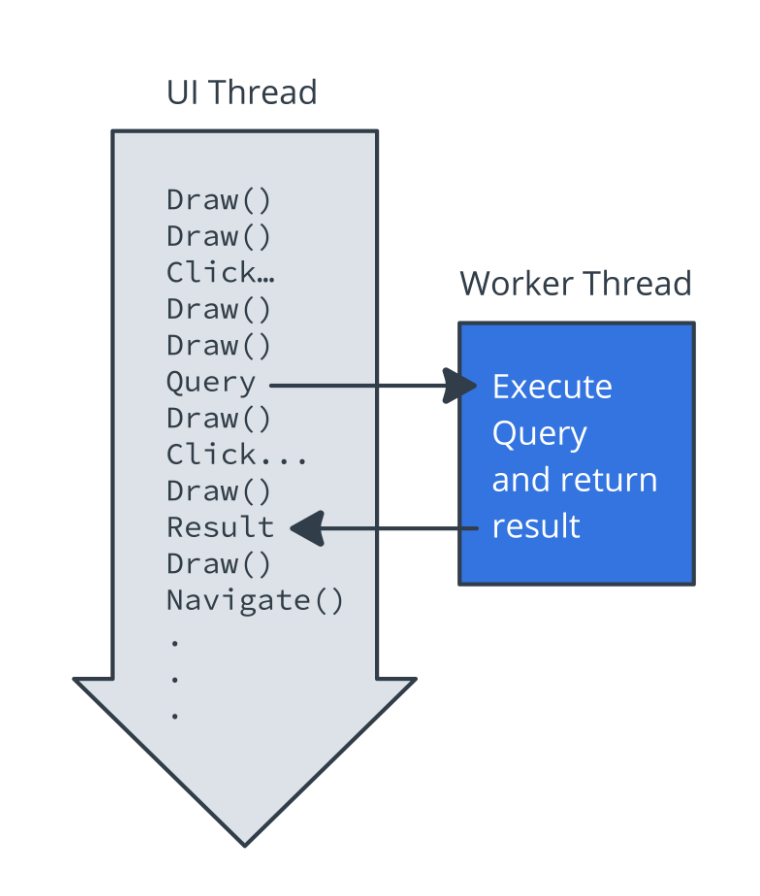
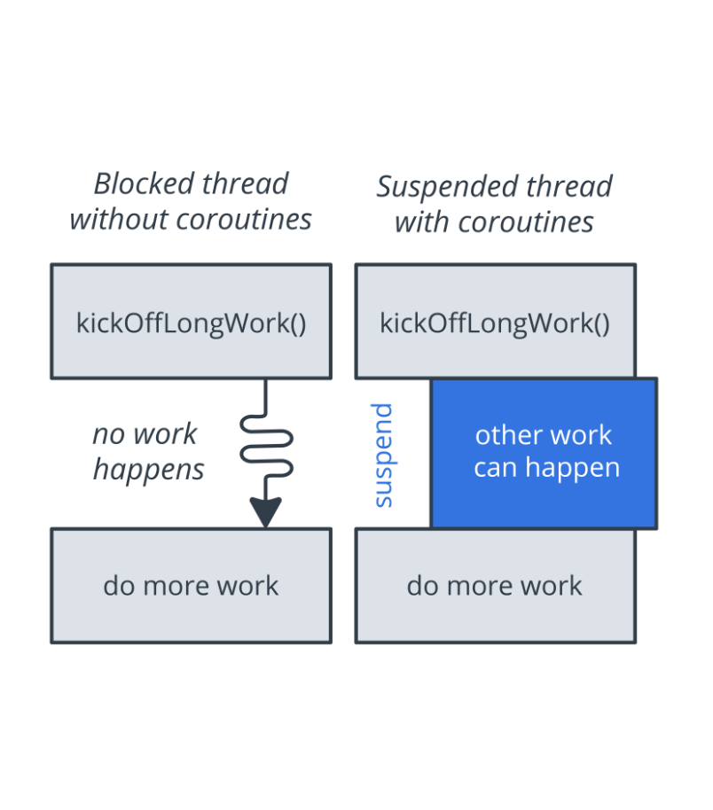

<!-- headingDivider: 2 -->

# Background work


## Threads



## Coroutines



- Coroutines are asynchronous and non-blocking.
- Coroutines use suspend functions to make asynchronous code sequential.

## Suspending

Suspend functions are only allowed to be called from a coroutine or another suspend function

```kotlin
suspend fun doSomethingLong() {
    // request server, DB, filesystem, ...
}

fun main() {
    doSomethingLong() // ❌ KO

    GlobalScope.launch {
        doSomethingLong() // ✅ OK
    }
}

suspend fun otherSuspendFunction() {
    doSomethingLong() // ✅ OK
}
```

## Couroutine Context

Coroutines always execute in some `CoroutineContext`: a set of various elements, mainly its `Job` and its `CoroutineDispatcher`

## Scope

A coroutine's scope defines the context in which the coroutine runs.

- A scope combines information about a coroutine's `Job` and `CoroutineDispatcher`
- Scopes keep track of coroutines that are “in them”

➡️ actually just a wrapper around a `CoroutineContext`, can be seen as a "parent context"

ex: `GlobalScope`, `MainScope`, `viewModelScope`, `lifeCycleScope`

## Job

Basically, a `Job` is anything that can be canceled

- Every coroutine has a `Job`, and you can use it to cancel the coroutine
- Jobs can be arranged into parent-child hierarchies
- Canceling a parent job immediately cancels all the job's children

```kotlin
fun main() {
    val job = GlobalScope.launch {
        // do something long
    }
    if (input == `^C`) job.cancel()
}
```

## Dispatcher

The `CoroutineDispatcher` sends off coroutines to run on various threads

ex: `Dispatcher.Main` runs tasks on the main thread, `Dispatcher.IO` offloads blocking I/O tasks to a shared pool of threads

```kotlin
fun main() {
    GlobalScope.launch(Dispatchers.IO) {
        // do something long on IO thread
    }
}
```

## Usage

```kotlin
val job = scope.launch { /* Do something long */ }
job.join() // wait for work to finish
job.cancel() // cancel work

val result: Deffered<SomeClass> = scope.async {
    mySuspendFun()
}
val result: SomeClass = result.await() // wait for result data
```

## Usage on Android

```kotlin
// in Repository
suspend fun getData() : Int = withContext(Dispatchers.IO) {
    // execute long IO operation
}

// in ViewModel
viewModelScope.launch { // canceled when ViewModel is destroyed
    repository.getData()
}


// in Fragment or Activity
lifecycleScope.launch { // canceled when fragment is destroyed
    whenStarted { /* starts when fragment is in started state */ }
    // the rest executes after the whenStarted block
}
lifecycleScope.launchWhenStarted { /* launches when fragment is in started state */ }
```

## Observer pattern

Design pattern that allows decoupling actions and data consumption by decoupling the _observable_ (or subject) from the _observers_ (or listeners):

```kotlin
val observable = Observable<Data>(initialData)

observable.notify(newData)

observable.observe { data -> /* use the value */ }
```

## Reactive Streams

Represent data as an async sequence that can be _observed_ : (pseudo-code)

```kotlin
val stream = Stream(null)

listOf("red", "white", "blue").forEach { color ->
    stream.send(color)
    wait(1000)
}

stream.filterNotNull()
      .map { it.toUpperCase() }
      .receiveEach { value -> log(value) }
```

Streams can be "hot" or "cold" (analogy: Radio // CD)

## Flow

Implementation of reactive streams based on coroutines:

```kotlin
val flow: Flow<String> = listOf("red", "white", "blue").asFlow()
            .map { it -> it.ToUpperCase() }
            .flowOn(Dispatchers.Default)

scope.launch {
    flow.collect { response -> println(response) }
}
```

## StateFlow

Special type of flow that always has a value:

```kotlin

// create and modify in ViewModel:
val userFlow = MutableStateFlow<NetworkUser?>(null)

suspend fun refreshUser() {
    userFlow.value = repository.fetchUser()
}

// react in Activity/Fragment:
lifecycleScope.launch {
    userFlow.filterNotNull().collect { user ->
      nameTextView.text = user.name
  }
}

// or in Compose:
val user by userFlow.collectAsState()

Text(user.name)

```
