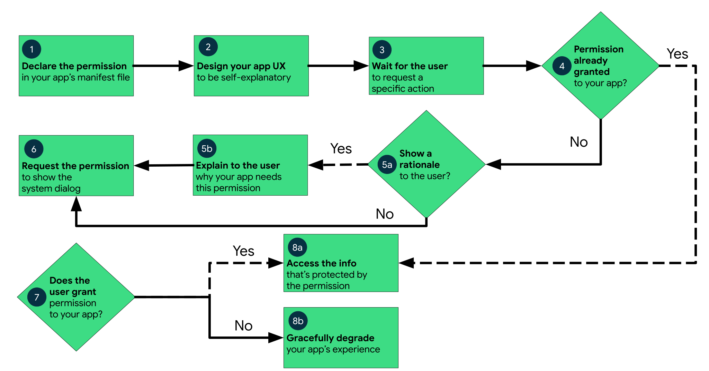
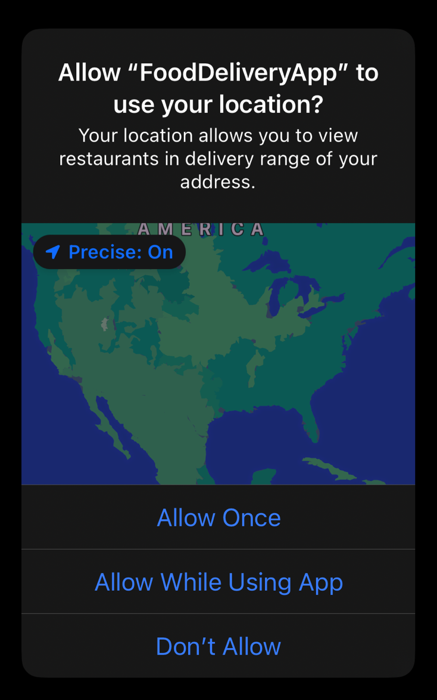

<!-- headingDivider: 2 -->

# Permissions


## Introduction


- Demander seulement si **vraiment** nécessaire: on peut en fait souvent faire sans.
- Permissions install-time vs. run-time (android ≧ 6.0)
- Peuvent être retirées par l'utilisateur ou le système (ex: app inutilisée depuis longtemps)

## Ajouter dans le manifest

```xml
<uses-permission android:name="android.permission.CAMERA" />
```

Pour les install-time permissions, c'est suffisant.

## Runtime permissions

- Vérifier si la permission a été donnée, expliquer le besoin et la demander sinon
- Exécuter l’action si la permission est donnée, ou expliquer pourquoi elle est impossible en cas de refus, et dégrader gracieusement l'expérience sans bloquer l'app
- Au bout de 2 refus, le système considère que c'est un "don't ask again" et n'affiche plus la pop-up



## Requête

```kotlin
// Register the permissions callback
val requestPermission =
  // rememberLauncherForActivityResult pour Compose
  registerForActivityResult(RequestPermission()) { isGranted ->
    if (isGranted) doRestrictedAction()
    else explainOrDefaultAction()
}

when {
  ContextCompat.checkSelfPermission(context, Manifest.permission.CAMERA)
     == PackageManager.PERMISSION_GRANTED -> doRestrictedAction()
  shouldShowRequestPermissionRationale(...) -> showExplanationUi()
  else -> requestPermission.launch(Manifest.permission.CAMERA) // ask for the permission
}
```

## Special permissions


- Une méthode spécifique pour demander si la permission est donnée pour chaque cas
- On passe par un `Intent` vers les settings de l'OS et un `onResume()` au lieu du `requestPermissionLauncher`

## Photo Picker


```kotlin
val pickMedia = registerForActivityResult(PickVisualMedia()) { uri ->
    if (uri != null) {
        Log.d("PhotoPicker", "Selected URI: $uri")
    }
}
pickMedia.launch(PickVisualMediaRequest(PickVisualMedia.ImageAndVideo))
pickMedia.launch(PickVisualMediaRequest(PickVisualMedia.ImageOnly))
pickMedia.launch(PickVisualMediaRequest(PickVisualMedia.VideoOnly))
val mimeType = pickMedia.launch(PickVisualMediaRequest(PickVisualMedia.SingleMimeType("image/gif"Type)))

val pickMultipleMedia =
        registerForActivityResult(PickMultipleVisualMedia(5)) { uris ->
    if (uris.isNotEmpty()) ...
}
pickMultipleMedia.launch(...))

// Si besoin de garder l'URI après que l'app soit stoppée:
context.contentResolver.takePersistableUriPermission(uri, Intent.FLAG_GRANT_READ_URI_PERMISSION)
```

(Android ≧ 11.0 + backport jusqu'à 4.4 avec Play Services)

## Permissions



Plus simple: on définit quelques textes dans des fichiers de configuration, ils seront utilisés pour remplir la popup quand l'OS l'estime nécessaire


## Photo picker


Depuis iOS 14, on peut choisir de ne pas partager toutes ses photos
On peut lancer le photo picker limité programmatiquement (et avec une callback depuis iOS 15):

```swift
PHPhotoLibrary.shared().presentLimitedLibraryPicker(from: viewController) { identifiers in
    for newlySelectedAssetIdentifier in identifiers { ... }
}
```

Depuis SwiftUI, on peut utiliser `PhotoPicker` qui place un overlay sur une image:

```swift
PhotosPicker(
    selection: $viewModel.imageSelection, // logique à gérer dans le VM
    matching: .images,
    photoLibrary: .shared()) {
  Image(...)
}
```
