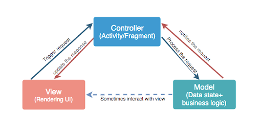
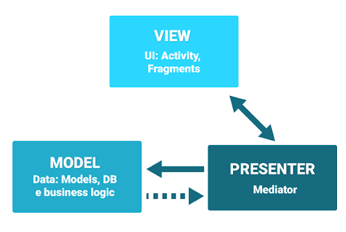
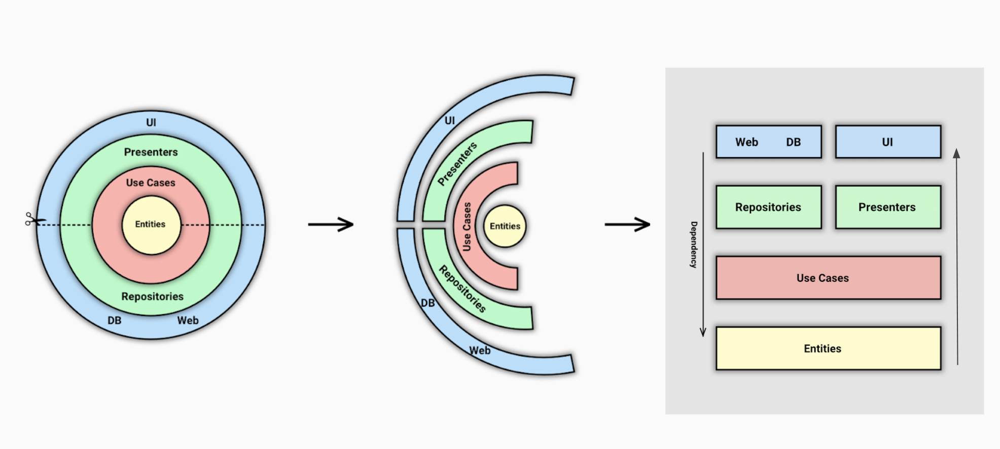
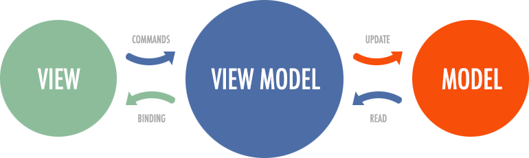
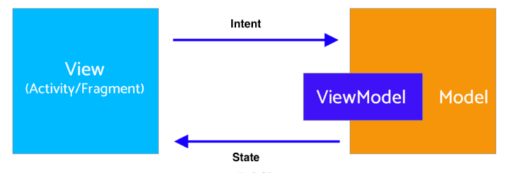

<!-- headingDivider: 2 -->

# Architecture

## MVC

Model View Controller

## MVP

Model View Presenter

## Dependency Rule

## Clean Architecture

# MVVM

Model View ViewModel

## MVI

Model View Intent

⚠️ Ici `Intent` n'est pas le type spécifique à Android

💡 Ceci s'adapte encore plus directement avec Jetpack Compose

## Google Architecture

## ViewModel

- Formate les données pour l'UI
- Survis aux configuration changes
- Peut aussi partager des données entre Fragments
- Fait partie lifecycle library
- Ne pas passer de Context (si besoin, étendre AndroidViewModel)

Analogie: Serveur

## Repository

- Pas un Architecture Components mais une bonne pratique
- Récupère les données d'une ou plusieurs `DataSource`
- Choisis la source en fonction des circonstances
- Synchronise les sources
- Présente les données

Analogie: Cuisine

## Compose

https://developer.android.com/jetpack/compose/architecture