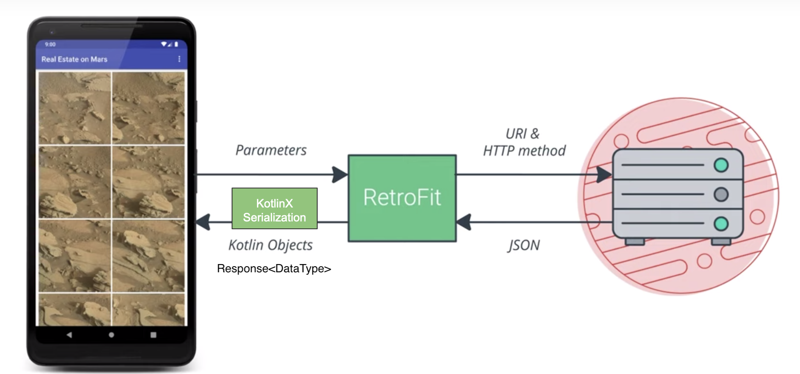

<!-- headingDivider: 2 -->

# L'internet


## HTTP


- GET: read data
- POST / PUT: write data
- DELETE: delete data

REST: Representational state transfer
CRUD: Create, Read, Update, Delete

## Permission

```xml
// Necessary to make HTTP requests
<uses-permission android:name="android.permission.INTERNET"/>
```

## Build a URI & Request

the old way:

```kotlin
val uri = Uri.parse("https://www.googleapis.com/books/v1/volumes")
  .buildUpon()
  .appendQueryParameter("q", "pride+prejudice")
  .appendQueryParameter("maxResults", "10")
  .appendQueryParameter("printType", "books")
  .build()

val queue = Volley.newRequestQueue(context)
val stringRequest = StringRequest(Request.Method.GET, uri.toString(),
        Response.Listener<String> { response -> ... },
        Response.ErrorListener { ... })
queue.add(stringRequest)
```

Parsing example: [with GSON](https://developer.android.com/training/volley/request-custom#example:-gsonrequest)

## Request a server



## HTTP Client

with OkHttp

```kotlin
private val okHttpClient = OkHttpClient.Builder()
    .addInterceptor { chain ->
      val newRequest = chain.request().newBuilder()
        .addHeader("Authorization", "Bearer $TOKEN")
        .build()
      chain.proceed(newRequest)
    }
    .build()
```

## Parsing JSON

with KotlinX Serialization (see also: [Moshi](https://github.com/square/moshi))

```kotlin
val movieJson = """{
  \"id\": 19404,
  \"title\": \"Example Movie\",
  \"image_path\":\"/example-movie-image.jpg\"
}"""

@Serializable
data class Movie (
  val id: Int,
  val title: String,
  @SerialName("image_path")
  val imagePath: String? = null,
)

private val jsonSerializer = Json {
  ignoreUnknownKeys = true
  coerceInputValues = true
}

val converterFactory = jsonSerializer.asConverterFactory("application/json".toMediaType())
```

## Api Service

with Retrofit

```kotlin
val BASE_URL = "https://movies.com/API/"

val retrofit = Retrofit.Builder()
  .client(okHttpClient)
  .baseUrl(BASE_URL)
  .addConverterFactory(converterFactory)
  .build()

interface MovieWebService {
  @GET("movies/{user_id}")
  fun getMovies(@Path("user_id") userId: String): Response<List<Movie>>
}

// Create an object that *implements* MovieWebService
val movieWebService: MovieWebService = retrofit.create(MovieWebService::class.java)

// Pseudo-code equivalent
val movieWebService = object : MovieWebService {
    override fun getMovies(userId: String) : List<Movie> {
      val json = okHttpClient.get("$BASE_URL/movies/$userId")
      return converterFactory.convert<List<Movie>>(json)
    }
}

val movies = movieWebService.getMovies("myUserId") // Usage
```

## Config

Full implementation example:

```kotlin
object MovieApi {
  private const val BASE_URL = "https://movies.com/API/"

  private val okHttpClient = OkHttpClient.Builder().addInterceptor { chain ->
    val newRequest = chain.request().newBuilder().addHeader("Authorization", "Bearer $TOKEN").build()
    chain.proceed(newRequest)
  }.build()

  private val jsonSerializer = Json {
    ignoreUnknownKeys = true
    coerceInputValues = true
  }

  val converterFactory = jsonSerializer.asConverterFactory("application/json".toMediaType())

  val retrofit = Retrofit.Builder()
    .client(okHttpClient)
    .baseUrl(BASE_URL)
    .addConverterFactory(converterFactory)
    .build()

   val movieWebService: MovieWebService = retrofit.create(MovieWebService::class.java)
}
```
