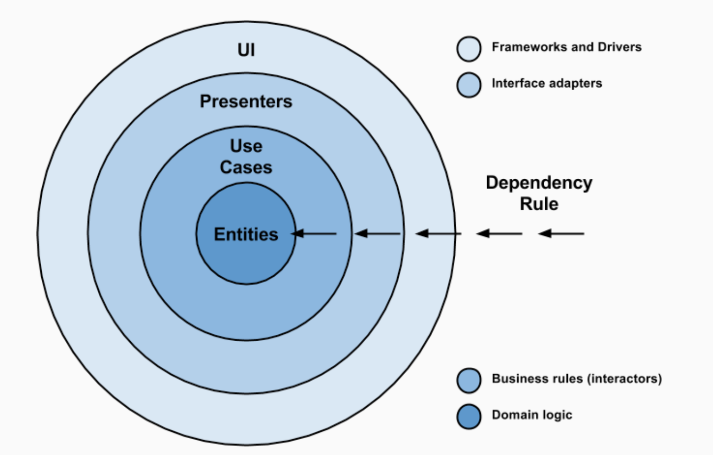
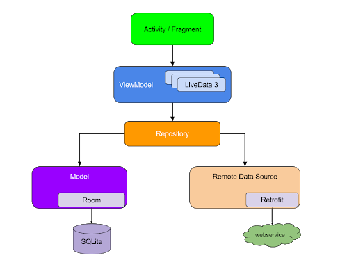

# TP5

**Prérequis**: Terminez au moins l'étape "Refactor: UserViewModel" du TP precedent

On va maintenant rendre l'app plus proche d'une app réelle en permettant de se logger au lieu d'avoir un token en dur

## Login / Sign up

- Créez une page en Compose avec un bouton de login
- Changer `token` dans `Api` en variable nullable et l'initialiser à `null`
- Ajouter un `checkNotNull(token)` dans l'interceptor
- Faites en sorte de naviguer vers cette nouvelle page lorsque le token est `null`

## OAuth

<aside class="positive">

[OAuth](https://en.wikipedia.org/wiki/OAuth) est un protocole d'authentification sécurisé utilisé par de nombreux services.
Il y a plusieurs étapes, mais en gros:

1. on requête un "authorization endpoint" en fournissant des identifiants en tant que client tiers (client id et secret) et des paramètres pour spécifier de quelles resources on a besoin (scopes)
2. l'utilisateur se connecte et accepte (il voit les resources demandées)
3. on récupère un code et une uri de redirection vers notre "site"
4. on revient dans l'app grace à cette uri
5. avec le code on interroge un "token endpoint" pour obtenir un "access token" pour notre utilisateur
6. on peut utiliser ce token comme avant dans nos requêtes API

J'ai déjà créé un client tiers donc je vais vous donner les identifiants mais vous pouvez créer le votre si vous voulez [sur Todoist](https://developer.todoist.com/appconsole.html).

Pour simplifier l'implémentation, on va utiliser la lib: <https://github.com/kalinjul/kotlin-multiplatform-oidc>, la configuration n'est pas évidente même en lisant le ReadMe donc je vous guide un peu.

</aside>

- ajoutez la dépendance dans `build.gradle`: `implementation("io.github.kalinjul.kotlin.multiplatform:oidc-appsupport:0.12.1")`
- customisez l'intent filter de l'activity définie dans la lib en rajoutant ceci à votre Manifest:

```xml
<activity
    android:name="org.publicvalue.multiplatform.oidc.appsupport.HandleRedirectActivity"
    android:exported="true">
    <intent-filter tools:node="removeAll" />
    <intent-filter android:autoVerify="true">
        <action android:name="android.intent.action.VIEW" />

        <category android:name="android.intent.category.DEFAULT" />
        <category android:name="android.intent.category.BROWSABLE" />

        <data
            android:host="cyrilfind.kodo"
            android:scheme="https"
            android:path="/redirect_uri" />
    </intent-filter>
</activity>
```

- Dans le controller de l'écran de login, créez une factory permettant de lancer le flow d'authentification et un client OAuth:

```kotlin
val codeAuthFlowFactory = AndroidCodeAuthFlowFactory()
val oAuthClient = OpenIdConnectClient {
    endpoints {
        authorizationEndpoint = "https://todoist.com/oauth/authorize"
        tokenEndpoint = "https://todoist.com/oauth/access_token"
    }

    clientId = "a9400191c656400fb31a043e530c5522"
    clientSecret = "198815c02ac94f029a00338135a45123"
    scope = "task:add,data:read_write,data:delete"
    redirectUri = "https://cyrilfind.kodo/redirect_uri"
}
```

- Essayez de comprendre un peu les éléments configurés ci dessus en relisant l'explication sur OAuth plus haut

## Login

- Créez une méthode qui lance le flow d'authentification: (à compléter)

```kotlin
fun login() {
 // ...
 val tokenResponse = codeAuthFlowFactory.createAuthFlow(oAuthClient).getAccessToken()
 val token = tokenResponse.access_token
 // ...
}
```

- Affectez la valeur du token celle dans`Api` puis naviguez vers l'écran qui liste les tâches
- Utilisez cette fonction au clic sur le bouton de login
- Lancez l'app, le flow devrait se lancer en vous proposant de vous connecter à Todoist mais ensuite la redirection ne va pas fonctionner:

<aside class="negative">

On a mis la `redirect_uri` dans l'intent filter, c'est ce qu'on appelle un "deeplink"
Mais à ce stade, il est ignoré car il doit normalement être "vérifiée".
Je vous passe les détails mais comme on est sur une app de test, pas déployée sur Google Play, on va l'autoriser manuellement:

- Aller dans les détails système de l'app, par exemple en appuyant longtemps sur son icône
- Allez dans "Ouvrir par défaut" puis "Ajouter lien"
- Cochez "cyrilfind.kodo"

</aside>

- Relancez le flow, tout devrait fonctionner

## Preference DataStore

Pour l'instant le soucis c'est que vous devez vous reconnecter à chaque lancement de l'app, on va y remédier en utilisant un stockage qui dure au delà d'une session d'utilisation de l'app.

- Ajoutez la librairie dans `build.gradle`: `implementation("androidx.datastore:datastore-preferences:1.1.1")`
- Créez une classe `TokenRepository` et une instance de `DataStore` globale et complétez:

```kotlin

private val Context.userDatastore by preferencesDataStore("user")

class TokenRepository(val context: Context) {
    private val key = stringPreferencesKey("token")

    val tokenFlow = context.userDatastore.data.map { ... }

    suspend fun store(token: String) {
        context.userDatastore.edit { ... }
    }

    suspend fun clear() {
        context.userDatastore.edit { ... }
    }
}
```

- Dans l'écran liste, créez une instance de `TokenRepository` et collectez le `tokenFlow`
- Chaque nouvelle valeur doit s'appliquer au token dans `Api` et déclencher un refresh des tasks, sauf si la valeur est nulle, dans ce cas il faut naviguer vers le login
- Dans l'écran login, créez une instance de `TokenRepository` et enregistrez le token avec quand il est récupéré
- Dans l'écran "user", créez une instance de `TokenRepository`, ajouter un bouton logout et effacer le token quand on clique dessus.

## Navigation

- Dans MainActivity, remplacer le `setContentView` par un `setContent {}` et ajouter un `NavHost` Compose
- Mettez vos écrans Compose directement dedans
- Mettez l'écran principal (liste) avec un Composant `AndroidFragment`

<aside class="positive">

  Je vous laisse vous débrouiller avec [la doc](https://developer.android.com/guide/navigation/design#compose), vous êtes quasiment des pro maintenant !

</aside>

## Injection de dépendance

<aside class="positive">

Parmi les grands principes SOLID, il y en a un fondamental qui est la "Dependency Inversion" qui dit en gros que les composants externes doivent dépendre des composants interne et pas l'inverse, ce qui nécessite de passer par des interfaces à implémenter: chaque couche définit une interface ("ce dont on a besoin") et la couche d'en dessous l'implémente ("comment c'est fait").

<!--  -->

Afin de gérer cela on utilise souvent une lib d'injection de dépendance, qui permet de dire: si on a besoin de `InterfaceA` alors on va utiliser `ClassA` qui implémente `InterfaceA` et éventuellement créer une instance directement.
En procédant ainsi, on crée un arbre de dépendances ou chaque implémentation est remplaçable facilement.

</aside>

- Ajouter la lib [Koin](https://insert-koin.io/docs/setup/koin#android) dans `build.gradle` et suivez les étapes de configuration
- créez un module koin `appModule` et y ajoutez la classe `TokenRepository` en `single` et vos ViewModels
- récupérez cette instance unique dans vos 2 écrans

## Repository

Refactorisez toute l'app pour que vos écrans ne récupèrent qu'un objet "state", et remontent seulement des évènements vers des ViewModel qui eux même interrogent des Repository partagés.

<!--  -->

## Interfaces

- Renommez `TaskRepository` en `TaskRepositoryImpl` et créez une nouvelle interface `TaskRepository`
- Adaptez le module Koin et le reste du code pour que seule l'interface soit utilisée
- Faites de même pour les autres Repository

## Tests unitaires

- Créez `LoginViewModelTest` et ajoutez des tests unitaires avec [Mockk](https://mockk.io/) pour remplacer les implémentations concrètes des Repository
- Faites de même pour les autres écrans et Repository
